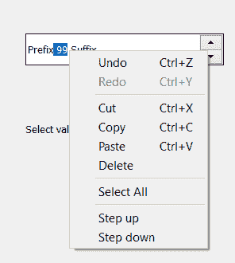

# PyQt5 QSpinBox–选择所有文本

> 原文:[https://www . geesforgeks . org/pyqt 5-qspinbox-select-all-the-text/](https://www.geeksforgeeks.org/pyqt5-qspinbox-selecting-all-the-text/)

在本文中，我们将看到如何选择旋转框的所有文本，选择文本并不意味着打印或只选择它。当我们用鼠标选择文本时，选中的文本会突出显示，在鼠标右键的帮助下，我们可以看到复制选项和其他选项。以下是所选文本以及按下右键时的外观。


为了选择文本我们使用`selectAll`方法。

> **语法:**旋转框。选择全部()
> 
> **论证:**不需要论证
> 
> **执行的操作:**选择旋转框的文本

**注意:**它选择除前缀和后缀之外的旋转框中的所有文本。

**实施步骤:**
1。创建旋转框
2。添加后缀和前缀(可选)
3。设置旋转框的范围(增加数值)
4。创建一个标签来显示关于按钮
4 的信息。创建一个按钮并添加动作
5。在操作中，选择旋转框的文本

下面是实现

```
# importing libraries
from PyQt5.QtWidgets import * 
from PyQt5 import QtCore, QtGui
from PyQt5.QtGui import * 
from PyQt5.QtCore import * 
import sys

class Window(QMainWindow):

    def __init__(self):
        super().__init__()

        # setting title
        self.setWindowTitle("Python ")

        # setting geometry
        self.setGeometry(100, 100, 600, 400)

        # calling method
        self.UiComponents()

        # showing all the widgets
        self.show()

    # method for widgets
    def UiComponents(self):

        # creating spin box
        self.spin = QSpinBox(self)

        # setting geometry to spin box
        self.spin.setGeometry(100, 100, 250, 40)

        # setting prefix to spin
        self.spin.setPrefix("Prefix ")

        # setting suffix to spin
        self.spin.setSuffix(" Suffix")

        # setting range to spin
        self.spin.setRange(0, 99999)

        # creating label
        self.label = QLabel(self)

        # setting geometry
        self.label.setGeometry(100, 200, 300, 40)

        # setting text to the label
        self.label.setText("When push button get pressed value get selected")

        # creating push button
        button = QPushButton("Press", self)

        # adding action to the push button
        button.clicked.connect(self.push_method)

    # method called by push button
    def push_method(self):

        # selecting all the text in spin box
        self.spin.selectAll()

# create pyqt5 app
App = QApplication(sys.argv)

# create the instance of our Window
window = Window()

# start the app
sys.exit(App.exec())
```

**输出:**

<video class="wp-video-shortcode" id="video-410670-1" width="640" height="428" preload="metadata" controls=""><source type="video/mp4" src="https://media.geeksforgeeks.org/wp-content/uploads/20200509020959/Python-09-05-2020-02_09_31.mp4?_=1">[https://media.geeksforgeeks.org/wp-content/uploads/20200509020959/Python-09-05-2020-02_09_31.mp4](https://media.geeksforgeeks.org/wp-content/uploads/20200509020959/Python-09-05-2020-02_09_31.mp4)</video>