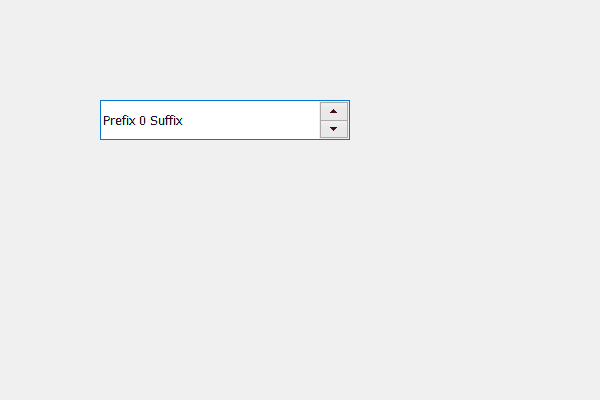

# PyQt5 QSpinBox–设置可访问名称

> 原文:[https://www . geesforgeks . org/pyqt 5-qspinbox-setting-accessible-name/](https://www.geeksforgeeks.org/pyqt5-qspinbox-setting-accessible-name/)

在本文中，我们将看到如何为旋转框设置名称，名称基本上用于区分旋转框，程序员可以根据旋转框的用途为其命名，这样它们就可以很容易区分，默认情况下，组合框没有名称。

为了做到这一点，我们使用`setAccessibleName`方法。

> **语法:** spin_box.setAccessibleName(名称)
> 
> **自变量:**以字符串为自变量
> 
> **返回:**返回无

下面是实现

```py
# importing libraries
from PyQt5.QtWidgets import * 
from PyQt5 import QtCore, QtGui
from PyQt5.QtGui import * 
from PyQt5.QtCore import * 
import sys

class Window(QMainWindow):

    def __init__(self):
        super().__init__()

        # setting title
        self.setWindowTitle("Python ")

        # setting geometry
        self.setGeometry(100, 100, 600, 400)

        # calling method
        self.UiComponents()

        # showing all the widgets
        self.show()

    # method for widgets
    def UiComponents(self):
        # creating spin box
        self.spin = QSpinBox(self)

        # setting geometry to spin box
        self.spin.setGeometry(100, 100, 250, 40)

        # setting prefix to spin
        self.spin.setPrefix("Prefix ")

        # setting suffix to spin
        self.spin.setSuffix(" Suffix")

        # name
        name = " Geek Spin box "

        # setting name to spin box
        self.spin.setAccessibleName(name)

# create pyqt5 app
App = QApplication(sys.argv)

# create the instance of our Window
window = Window()

# start the app
sys.exit(App.exec())
```

**输出:**
