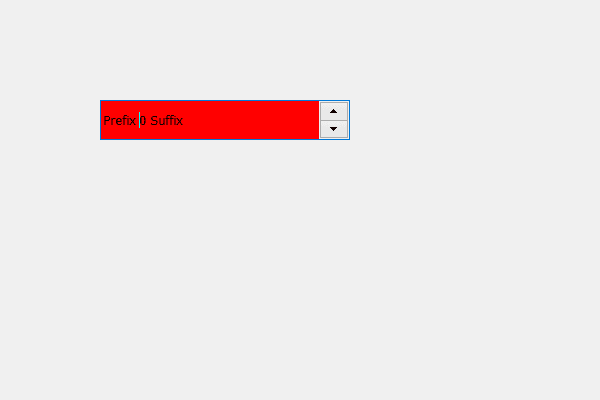

# PyQt5 QSpinBox–设置自动填充背景属性

> 原文:[https://www . geesforgeks . org/pyqt5-qspinbox-设置-自动填充-背景-属性/](https://www.geeksforgeeks.org/pyqt5-qspinbox-setting-auto-fill-background-property/)

在本文中，我们将看到如何设置旋转框的自动填充属性，该属性将导致 Qt 在调用 paint 事件之前填充旋转框的背景。使用的颜色由旋转框调色板中的`QPalette.Window`颜色角色定义。默认情况下，此属性为 false。

此属性应结合 Qt 样式表谨慎处理。当旋转框的样式表具有有效的背景或边框图像时，此属性会自动禁用。

为此，我们使用了 setAutoFillBackgroun 方法。

> **语法:**旋转框。设置自动填充背景(真)
> 
> **参数:**需要布尔参数
> 
> **返回:**返回无

**注意:**如果旋转框的父对象的背景具有静态渐变，则不能关闭该属性(即设置为 false)。

下面是实现

```
# importing libraries
from PyQt5.QtWidgets import * 
from PyQt5 import QtCore, QtGui
from PyQt5.QtGui import * 
from PyQt5.QtCore import * 
import sys

class Window(QMainWindow):

    def __init__(self):
        super().__init__()

        # setting title
        self.setWindowTitle("Python ")

        # setting geometry
        self.setGeometry(100, 100, 600, 400)

        # calling method
        self.UiComponents()

        # showing all the widgets
        self.show()

    # method for widgets
    def UiComponents(self):
        # creating spin box
        self.spin = QSpinBox(self)

        # setting geometry to spin box
        self.spin.setGeometry(100, 100, 250, 40)

        # setting prefix to spin
        self.spin.setPrefix("Prefix ")

        # setting suffix to spin
        self.spin.setSuffix(" Suffix")

        # allowing spin box to auto fill background
        self.spin.setAutoFillBackground(True)

        # filling background using palette of spin box
        # and setting its color to the red
        self.spin.setForegroundRole(QPalette.Base)
        p = self.spin.palette()
        p.setColor(self.spin.foregroundRole(), Qt.red)
        self.spin.setPalette(p)

# create pyqt5 app
App = QApplication(sys.argv)

# create the instance of our Window
window = Window()

# start the app
sys.exit(App.exec())
```

**输出:**
