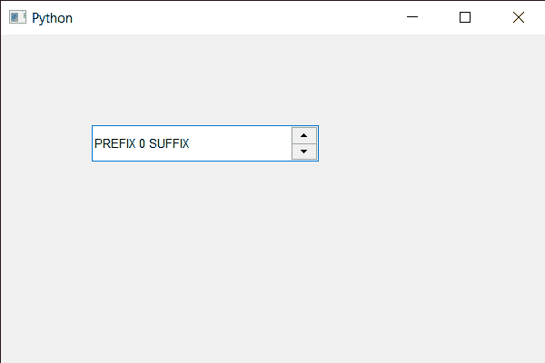

# PyQt5 QSpinBox–设置固定间距

> 原文:[https://www . geesforgeks . org/pyqt 5-qspinbox-setting-fixed-pitch/](https://www.geeksforgeeks.org/pyqt5-qspinbox-setting-fixed-pitch/)

在本文中，我们将看到如何使用系统字体为旋转框创建单间距字体(固定间距)，单间距字体，也称为固定间距、固定宽度或非比例字体，是一种字母和字符各占据相同水平空间的字体。这与可变宽度字体形成对比，可变宽度字体中的字母和间距具有不同的宽度。借助`font`方法可以得到旋转框的 QFont 对象。

> 为此，我们对旋转框的 QFont 对象使用了 setFixedPitch 方法
> 
> **语法:**字体. setfixed dpitch(true)
> 
> **自变量:**它以布尔为自变量
> 
> **返回:**返回无

下面是实现

```
# importing libraries
from PyQt5.QtWidgets import * 
from PyQt5 import QtCore, QtGui
from PyQt5.QtGui import * 
from PyQt5.QtCore import * 
import sys

class Window(QMainWindow):

    def __init__(self):
        super().__init__()

        # setting title
        self.setWindowTitle("Python ")

        # setting geometry
        self.setGeometry(100, 100, 600, 400)

        # calling method
        self.UiComponents()

        # showing all the widgets
        self.show()

        # method for widgets
    def UiComponents(self):
        # creating spin box
        self.spin = QSpinBox(self)

        # setting geometry to spin box
        self.spin.setGeometry(100, 100, 250, 40)

        # setting range to the spin box
        self.spin.setRange(0, 999999)

        # setting prefix to spin
        self.spin.setPrefix("PREFIX ")

        # setting suffix to spin
        self.spin.setSuffix(" SUFFIX")

        # getting font of the spin box
        font = QFont('Arial')

        # making font mono-spaced
        font.setFixedPitch(True)

        # setting back this font to the spin box
        self.spin.setFont(font)

# create pyqt5 app
App = QApplication(sys.argv)

# create the instance of our Window
window = Window()

# start the app
sys.exit(App.exec())
```

**输出:**
