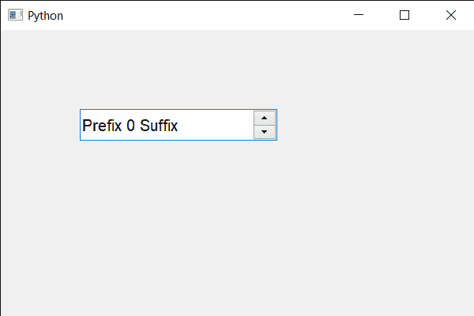

# PyQt5 QSpinBox–将字体设置为整篇文字

> 原文:[https://www . geeksforgeeks . org/pyqt 5-qspinbox-setting-font-to-the-text/](https://www.geeksforgeeks.org/pyqt5-qspinbox-setting-font-to-the-whole-text/)

在本文中，我们将看到如何更改旋转框中所有文本的大小和字体，为此，我们将使用以`QFont`对象为参数的`setFont`方法，将其与旋转框对象一起使用将更改所有文本的字体。

> **语法:** spin_box.setFont(字体)
> 
> **自变量:**它以 QFont 对象为自变量
> 
> **返回:**返回无

下面是实现

```
# importing libraries
from PyQt5.QtWidgets import * 
from PyQt5 import QtCore, QtGui
from PyQt5.QtGui import * 
from PyQt5.QtCore import * 
import sys

class Window(QMainWindow):

    def __init__(self):
        super().__init__()

        # setting title
        self.setWindowTitle("Python ")

        # setting geometry
        self.setGeometry(100, 100, 600, 400)

        # calling method
        self.UiComponents()

        # showing all the widgets
        self.show()

        # method for widgets
    def UiComponents(self):
        # creating spin box
        self.spin = QSpinBox(self)

        # setting geometry to spin box
        self.spin.setGeometry(100, 100, 250, 40)

        # setting range to the spin box
        self.spin.setRange(0, 999999)

        # setting prefix to spin
        self.spin.setPrefix("Prefix ")

        # setting suffix to spin
        self.spin.setSuffix(" Suffix")

        # font
        font = QFont('Arial', 12)

        # setting font to the spin box
        self.spin.setFont(QFont(font))

# create pyqt5 app
App = QApplication(sys.argv)

# create the instance of our Window
window = Window()

# start the app
sys.exit(App.exec())
```

**输出:**
