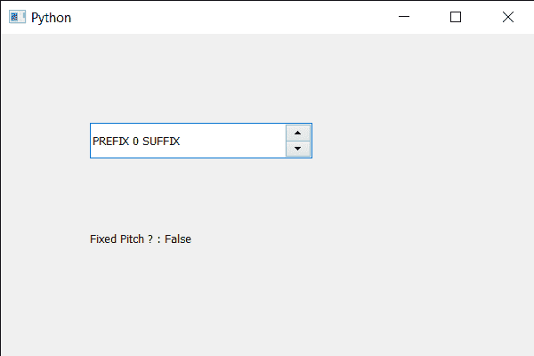

# PyQt5 QSpinBox–设置提示首选项

> 原文:[https://www . geesforgeks . org/pyqt 5-qspinbox-设置-提示-偏好-2/](https://www.geeksforgeeks.org/pyqt5-qspinbox-setting-hinting-preference-2/)

在本文中，我们将了解如何检查旋转框的文本是否是固定间距的，单间距字体，也称为固定间距、固定宽度或非比例字体，是一种字母和字符各占据相同水平空间的字体。这与可变宽度字体形成对比，可变宽度字体中的字母和间距具有不同的宽度。

为了获得字体的信息，我们必须获得旋转框的 QFontInfo 对象，这可以使用`fontInfo`方法来完成。

> 为了做到这一点，我们用旋转框的 QFontInfo 对象来固定一个方法
> 
> **语法:**font _ info . fixed dpitch()
> 
> **论证:**不需要论证
> 
> **返回:**返回 bool

下面是实现

```py
# importing libraries
from PyQt5.QtWidgets import * 
from PyQt5 import QtCore, QtGui
from PyQt5.QtGui import * 
from PyQt5.QtCore import * 
import sys

class Window(QMainWindow):

    def __init__(self):
        super().__init__()

        # setting title
        self.setWindowTitle("Python ")

        # setting geometry
        self.setGeometry(100, 100, 600, 400)

        # calling method
        self.UiComponents()

        # showing all the widgets
        self.show()

        # method for widgets
    def UiComponents(self):
        # creating spin box
        self.spin = QSpinBox(self)

        # setting geometry to spin box
        self.spin.setGeometry(100, 100, 250, 40)

        # setting range to the spin box
        self.spin.setRange(0, 999999)

        # setting prefix to spin
        self.spin.setPrefix("PREFIX ")

        # setting suffix to spin
        self.spin.setSuffix(" SUFFIX")

        # creating a label
        label = QLabel(self)

        # setting geometry to the label
        label.setGeometry(100, 200, 300, 60)

        # getting the font info
        font_info = self.spin.fontInfo()

        # getting fixed pitch status of text
        check = font_info.fixedPitch()

        # setting text to the label
        label.setText("Fixed Pitch ? : " + str(check))

# create pyqt5 app
App = QApplication(sys.argv)

# create the instance of our Window
window = Window()

# start the app
sys.exit(App.exec())
```

**输出:**
