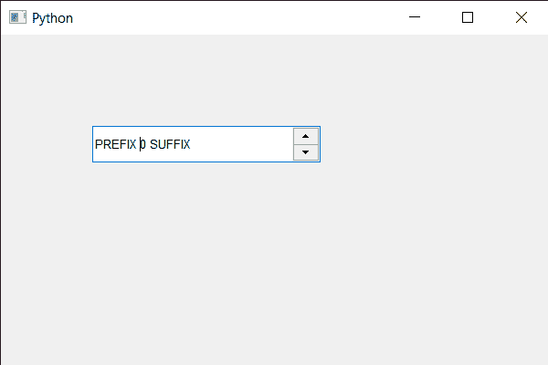

# PyQt5 QSpinBox–设置提示首选项

> 原文:[https://www . geesforgeks . org/pyqt 5-qspinbox-设置-提示-偏好-3/](https://www.geeksforgeeks.org/pyqt5-qspinbox-setting-hinting-preference-3/)

在本文中，我们将了解如何将提示首选项设置为旋转框，有不同级别的提示可以应用于字形，以提高显示器的易读性，这可能是由像素密度保证的。

> 以下是旋转框可用的首选项类型
> 
> **首选默认提示:**使用旋转框的默认提示级别
> 
> **PreferNoHinting :** 它在不提示字形轮廓的情况下渲染文本。文本布局在印刷上是精确的和可缩放的，使用与打印时相同的度量标准。
> 
> **首选垂直提示:**它渲染没有水平提示的文本，但在垂直方向将字形与像素网格对齐。在密度太低而无法准确呈现字形的显示器上，文本会显得更清晰。
> 
> **preferful hinting:**它在水平和垂直两个方向呈现带有提示的文本。文本将被修改，以优化旋转框的易读性

> 为了做到这一点，我们对旋转框的 QFont 对象使用了 usesetHintingPreference 方法
> 
> **语法:**字体。setHintingPreference(QFont)。PreferFullHinting)
> 
> **参数:**它取 QFont 对象或者我们可以传递偏好值作为参数
> 
> **返回:**返回无

下面是实现

```
# importing libraries
from PyQt5.QtWidgets import * 
from PyQt5 import QtCore, QtGui
from PyQt5.QtGui import * 
from PyQt5.QtCore import * 
import sys

class Window(QMainWindow):

    def __init__(self):
        super().__init__()

        # setting title
        self.setWindowTitle("Python ")

        # setting geometry
        self.setGeometry(100, 100, 600, 400)

        # calling method
        self.UiComponents()

        # showing all the widgets
        self.show()

        # method for widgets
    def UiComponents(self):
        # creating spin box
        self.spin = QSpinBox(self)

        # setting geometry to spin box
        self.spin.setGeometry(100, 100, 250, 40)

        # setting range to the spin box
        self.spin.setRange(0, 999999)

        # setting prefix to spin
        self.spin.setPrefix("PREFIX ")

        # setting suffix to spin
        self.spin.setSuffix(" SUFFIX")

        # getting font of the spin box
        font = QFont('Arial')

        # setting hinting preference
        font.setHintingPreference(QFont.PreferFullHinting)

        # setting back this font to the spin box
        self.spin.setFont(font)

# create pyqt5 app
App = QApplication(sys.argv)

# create the instance of our Window
window = Window()

# start the app
sys.exit(App.exec())
```

**输出:**
