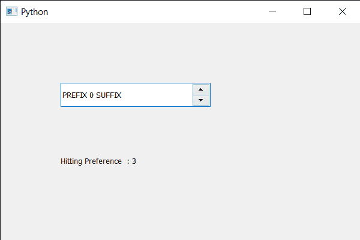

# PyQt5 QSpinBox–设置提示首选项

> 原文:[https://www . geeksforgeeks . org/pyqt 5-qspinbox-设置-提示-首选项/](https://www.geeksforgeeks.org/pyqt5-qspinbox-setting-hinting-preference/)

在本文中，我们将了解如何获得旋转框字体的提示首选项，有不同级别的提示可以应用于字形，以提高显示器的易读性，这可能是由像素密度保证的。我们可以借助`setHintingPreference`方法设置提示偏好。

> 为此，我们对旋转框的 QFont 对象使用了 hintingPreference 方法
> 
> **语法:**font . hinting reference()
> 
> **论证:**不需要论证
> 
> **Return :** 它返回偏好对象，但当我们打印它时，它会显示偏好的相应值。

下面是实现

```
# importing libraries
from PyQt5.QtWidgets import * 
from PyQt5 import QtCore, QtGui
from PyQt5.QtGui import * 
from PyQt5.QtCore import * 
import sys

class Window(QMainWindow):

    def __init__(self):
        super().__init__()

        # setting title
        self.setWindowTitle("Python ")

        # setting geometry
        self.setGeometry(100, 100, 600, 400)

        # calling method
        self.UiComponents()

        # showing all the widgets
        self.show()

        # method for widgets
    def UiComponents(self):
        # creating spin box
        self.spin = QSpinBox(self)

        # setting geometry to spin box
        self.spin.setGeometry(100, 100, 250, 40)

        # setting range to the spin box
        self.spin.setRange(0, 999999)

        # setting prefix to spin
        self.spin.setPrefix("PREFIX ")

        # setting suffix to spin
        self.spin.setSuffix(" SUFFIX")

        # getting font of the spin box
        font = self.spin.font()

        # setting hinting preference
        font.setHintingPreference(QFont.PreferFullHinting)

        # reassigning this font to the spin box
        self.spin.setFont(font)

        # creating a label
        label = QLabel(self)

        # setting geometry to the label
        label.setGeometry(100, 200, 300, 60)

        # getting hitting preference
        check = font.hintingPreference()

        # setting text to the label
        label.setText("Hitting Preference  : " + str(check))

# create pyqt5 app
App = QApplication(sys.argv)

# create the instance of our Window
window = Window()

# start the app
sys.exit(App.exec())
```

**输出:**
