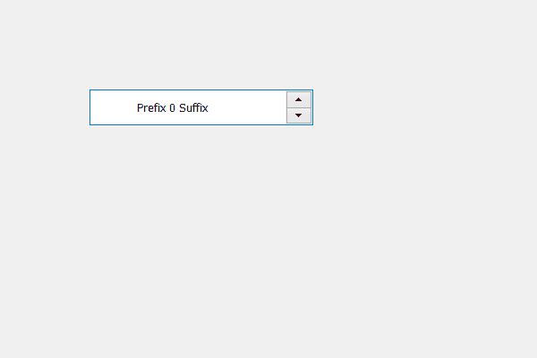

# PyQt5 QSpinBox–设置左边距

> 原文:[https://www . geesforgeks . org/pyqt5-qspinbox-setting-left-margin/](https://www.geeksforgeeks.org/pyqt5-qspinbox-setting-left-margin/)

在本文中，我们将了解如何设置或更改旋转框的左边距，默认情况下，旋转框没有边距设置，即它们的边距值为零。虽然我们可以改变这一点，但是将边距设置为数字显示框将不会显示数字显示框中的任何变化，因为小部件会进行覆盖以保持其结构。但是为了给旋转框设置边距，我们给旋转框的线编辑对象设置了边距，通过它我们可以在旋转框中显示边距。

为此，我们使用**设置左**方法。

> **语法:** margin.setLeft(n)
> 这里的 margin 是属于旋转框的 QLineEdit 对象的 QMargin 对象
> 
> **自变量:**以整数为自变量
> 
> **返回:**返回无

**实施步骤:**
1。创建旋转框
2。获取旋转框
3 的线条编辑对象。从旋转框
4 中获取边距对象。将左边距设置到旋转框
5。将此边距对象添加回线条编辑对象

下面是实现

```
# importing libraries
from PyQt5.QtWidgets import * 
from PyQt5 import QtCore, QtGui
from PyQt5.QtGui import * 
from PyQt5.QtCore import * 
import sys

class Window(QMainWindow):

    def __init__(self):
        super().__init__()

        # setting title
        self.setWindowTitle("Python ")

        # setting geometry
        self.setGeometry(100, 100, 600, 400)

        # calling method
        self.UiComponents()

        # showing all the widgets
        self.show()

        # method for widgets
    def UiComponents(self):
        # creating spin box
        self.spin = QSpinBox(self)

        # setting geometry to spin box
        self.spin.setGeometry(100, 100, 250, 40)

        # setting range to the spin box
        self.spin.setRange(0, 999999)

        # setting prefix to spin
        self.spin.setPrefix("Prefix ")

        # setting suffix to spin
        self.spin.setSuffix(" Suffix")

        # getting line edit object
        line_edit = self.spin.lineEdit()

        # getting margins
        margin = line_edit.contentsMargins()

        # setting left margin
        margin.setLeft(50)

        # setting this margin back to line edit
        line_edit.setContentsMargins(margin)

# create pyqt5 app
App = QApplication(sys.argv)

# create the instance of our Window
window = Window()
window.spin.setFocus()
# start the app
sys.exit(App.exec())
```

**输出:**
