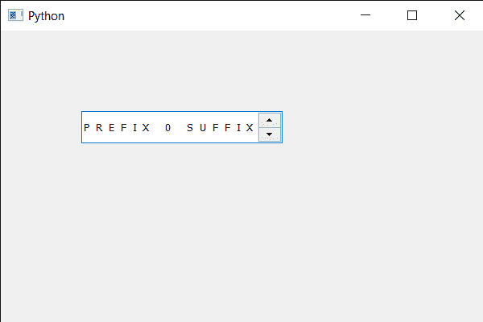

# PyQt5 QSpinBox–设置字母间距

> 原文:[https://www . geeksforgeeks . org/pyqt 5-qspinbox-setting-字母-间距/](https://www.geeksforgeeks.org/pyqt5-qspinbox-setting-letter-spacing/)

在本文中，我们将看到如何在旋转框的文本中设置字母间距，字母间距是两个连续字母之间的距离(间隙)。可以通过指定像素或百分比来更改间距。为了使用像素设置间距，我们使用`QFont.AbsoluteSpacing`作为间距类型，为了使用百分比设置间距，我们使用`QFont.PercentageSpacing`作为间距类型。

为了做到这一点，我们对旋转框的 QFont 对象使用`setLetterSpacing`方法

> **语法:** font.setLetterSpacing(类型，值)
> 
> **参数:**需要两个参数，一个是间距类型，另一个是浮点值
> 
> **返回:**返回无

下面是实现

```
# importing libraries
from PyQt5.QtWidgets import * 
from PyQt5 import QtCore, QtGui
from PyQt5.QtGui import * 
from PyQt5.QtCore import * 
import sys

class Window(QMainWindow):

    def __init__(self):
        super().__init__()

        # setting title
        self.setWindowTitle("Python ")

        # setting geometry
        self.setGeometry(100, 100, 600, 400)

        # calling method
        self.UiComponents()

        # showing all the widgets
        self.show()

        # method for widgets
    def UiComponents(self):
        # creating spin box
        self.spin = QSpinBox(self)

        # setting geometry to spin box
        self.spin.setGeometry(100, 100, 250, 40)

        # setting range to the spin box
        self.spin.setRange(0, 999999)

        # setting prefix to spin
        self.spin.setPrefix("PREFIX ")

        # setting suffix to spin
        self.spin.setSuffix(" SUFFIX")

        # getting font of the spin box
        font = self.spin.font()

        # setting letter spacing
        font.setLetterSpacing(QFont.AbsoluteSpacing, 8)

        # reassigning this font to the spin box
        self.spin.setFont(font)

# create pyqt5 app
App = QApplication(sys.argv)

# create the instance of our Window
window = Window()

# start the app
sys.exit(App.exec())
```

**输出:**
