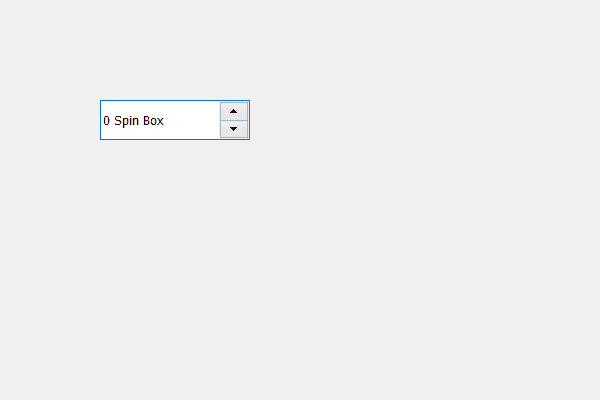

# PyQt5 QSpinBox–设置对象名称

> 原文:[https://www . geesforgeks . org/pyqt 5-qspinbox-setting-object-name/](https://www.geeksforgeeks.org/pyqt5-qspinbox-setting-object-name/)

在本文中我们将看到如何设置旋转框的对象名称，对象名称基本上是赋予旋转框对象的名称，当我们在 PyQt5 应用程序中借助对象名称借助`findChild`方法找到对象时。

为了做到这一点，我们将使用`setObjectName`方法..

> **语法:** spin_box.setObjectName(名称)
> 
> **自变量:**以字符串为自变量
> 
> **返回:**返回无

下面是实现

```
# importing libraries
from PyQt5.QtWidgets import * 
from PyQt5 import QtCore, QtGui
from PyQt5.QtGui import * 
from PyQt5.QtCore import * 
import sys

class Window(QMainWindow):

    def __init__(self):
        super().__init__()

        # setting title
        self.setWindowTitle("Python ")

        # setting geometry
        self.setGeometry(100, 100, 600, 400)

        # calling method
        self.UiComponents()

        # showing all the widgets
        self.show()

    # method for widgets
    def UiComponents(self):

        # creating spin box
        self.spin = QSpinBox(self)

        # setting geometry to spin box
        self.spin.setGeometry(100, 100, 150, 40)

        # setting suffix to spin
        self.spin.setSuffix(" Spin Box")

        # name
        name = "Geeky"

        # setting up object name
        self.spin.setObjectName(name)

# create pyqt5 app
App = QApplication(sys.argv)

# create the instance of our Window
window = Window()

# start the app
sys.exit(App.exec())
```

**输出:**
