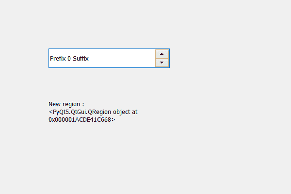

# PyQt5 QSpinBox–将矩形设置到子区域

> 原文:[https://www . geesforgeks . org/pyqt5-qspinbox-设置-矩形-给孩子-区域/](https://www.geeksforgeeks.org/pyqt5-qspinbox-setting-rectangles-to-the-children-region/)

在本文中，我们将看到如何将矩形设置为旋转框的子区域，子区域保存旋转框的子区域所占据的组合区域。为了得到孩子区域，我们使用`childrenRegion`方法。子区域由所有的矩形组成，但是如果我们只给它设置一些矩形，那么它会改变区域。

> 为此，我们对旋转框的子区域对象使用了 setRects 方法
> 
> **语法:** children_region.setRects(矩形)
> 
> **自变量:**以 QRect 的列表为自变量
> 
> **执行的动作:**设置区域

下面是实现

```
# importing libraries
from PyQt5.QtWidgets import * 
from PyQt5 import QtCore, QtGui
from PyQt5.QtGui import * 
from PyQt5.QtCore import * 
import sys

class Window(QMainWindow):

    def __init__(self):
        super().__init__()

        # setting title
        self.setWindowTitle("Python ")

        # setting geometry
        self.setGeometry(100, 100, 600, 400)

        # calling method
        self.UiComponents()

        # showing all the widgets
        self.show()

        # method for widgets

    def UiComponents(self):
        # creating spin box
        self.spin = QSpinBox(self)

        # setting geometry to spin box
        self.spin.setGeometry(100, 100, 250, 40)

        # setting range to the spin box
        self.spin.setRange(0, 999999)

        # setting prefix to spin
        self.spin.setPrefix("Prefix ")

        # setting suffix to spin
        self.spin.setSuffix(" Suffix")

        # getting the children region
        children_region = self.spin.childrenRegion()

        # creating a label
        label = QLabel(self)
        label.setWordWrap(True)

        # setting geometry to the label
        label.setGeometry(100, 200, 200, 60)

        # getting rectangles that are inside the children region
        rectangles = children_region.rects()

        # setting rectangle
        children_region.setRects(rectangles)

        # setting text to the label
        label.setText("New region : " + str(children_region))

# create pyqt5 app
App = QApplication(sys.argv)

# create the instance of our Window
window = Window()
window.spin.setFocus()
# start the app
sys.exit(App.exec())
```

**输出:**
