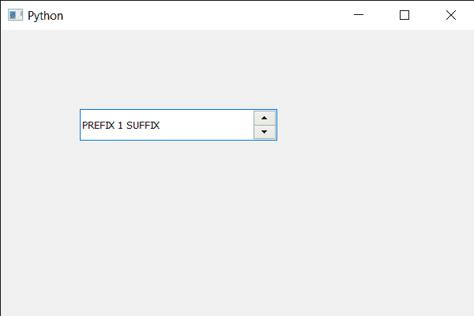

# PyQt5 QSpinBox–设置状态提示

> 原文:[https://www . geesforgeks . org/pyqt5-qspinbox-setting-status-tip/](https://www.geeksforgeeks.org/pyqt5-qspinbox-setting-status-tip/)

在本文中，我们将看到如何设置旋转框的状态提示。状态提示基本上是开发人员设置的文本，用于将旋转框状态的提示(信息)提供给其他开发人员。例如，当状态提示的值大于 90 时，我们可以将其设置为“高值”。

为了做到这一点，我们对旋转框对象使用`setStatusTip`方法。

> **语法:**旋转框. box.setStatusTip(文本)
> 
> **自变量:**以字符串为自变量
> 
> **返回:**返回无

下面是实现

```
# importing libraries
from PyQt5.QtWidgets import * 
from PyQt5 import QtCore, QtGui
from PyQt5.QtGui import * 
from PyQt5.QtCore import * 
import sys

class Window(QMainWindow):

    def __init__(self):
        super().__init__()

        # setting title
        self.setWindowTitle("Python ")

        # setting geometry
        self.setGeometry(100, 100, 600, 400)

        # calling method
        self.UiComponents()

        # showing all the widgets
        self.show()

        # method for widgets
    def UiComponents(self):
        # creating spin box
        self.spin = QSpinBox(self)

        # setting geometry to spin box
        self.spin.setGeometry(100, 100, 250, 40)

        # setting range to the spin box
        self.spin.setRange(1, 999999)

        # setting prefix to spin
        self.spin.setPrefix("PREFIX ")

        # setting suffix to spin
        self.spin.setSuffix(" SUFFIX")

        # setting status tip to the spin box
        self.spin.setStatusTip("Status Tip")

# create pyqt5 app
App = QApplication(sys.argv)

# create the instance of our Window
window = Window()

# start the app
sys.exit(App.exec())
```

**输出:**
