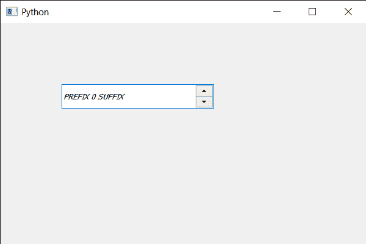

# PyQt5 QSpinBox–将样式设置为文本

> 原文:[https://www . geesforgeks . org/pyqt5-qspinbox-setting-stye-to-text/](https://www.geeksforgeeks.org/pyqt5-qspinbox-setting-stye-to-text/)

在本文中，我们将看到如何设置或更改旋转框文本的样式，设置样式意味着为其设置一些属性，旋转框的文本有许多可用的样式，例如样式倾斜、样式正常和样式倾斜默认情况下，它的样式设置为样式正常样式。

为了做到这一点，我们对旋转框的 QFont 对象使用`setStyle`方法。

> **语法:**字体. setStyle(样式)
> 
> **自变量:**它以 QFont 样式对象为自变量
> 
> **返回:**返回无

下面是实现

```
# importing libraries
from PyQt5.QtWidgets import * 
from PyQt5 import QtCore, QtGui
from PyQt5.QtGui import * 
from PyQt5.QtCore import * 
import sys

class Window(QMainWindow):

    def __init__(self):
        super().__init__()

        # setting title
        self.setWindowTitle("Python ")

        # setting geometry
        self.setGeometry(100, 100, 600, 400)

        # calling method
        self.UiComponents()

        # showing all the widgets
        self.show()

        # method for widgets
    def UiComponents(self):
        # creating spin box
        self.spin = QSpinBox(self)

        # setting geometry to spin box
        self.spin.setGeometry(100, 100, 250, 40)

        # setting range to the spin box
        self.spin.setRange(0, 999999)

        # setting prefix to spin
        self.spin.setPrefix("PREFIX ")

        # setting suffix to spin
        self.spin.setSuffix(" SUFFIX")

        # getting font of the spin box
        font = self.spin.font()

        # setting style
        font.setStyle(QFont.StyleOblique)

        # reassigning this font to the spin box
        self.spin.setFont(font)

# create pyqt5 app
App = QApplication(sys.argv)

# create the instance of our Window
window = Window()

# start the app
sys.exit(App.exec())
```

**输出:**
