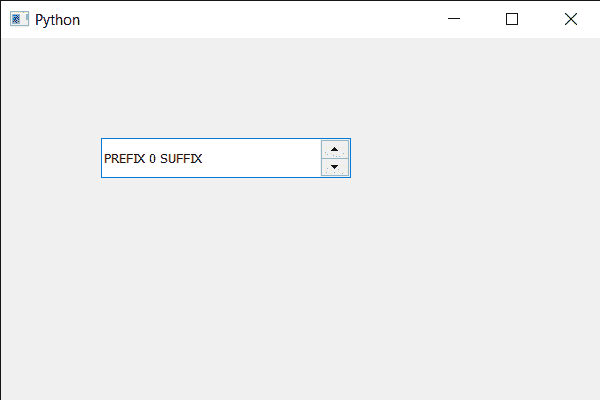

# PyQt5 QSpinBox–设置风格策略

> 原文:[https://www . geesforgeks . org/pyqt 5-qspinbox-设置-风格-策略/](https://www.geeksforgeeks.org/pyqt5-qspinbox-setting-style-strategy/)

在本文中，我们将看到如何为旋转框的文本设置样式策略。样式策略告诉字体匹配算法应该使用什么类型的字体来找到合适的默认字体系列。旋转框提供了许多策略，例如首选默认、首选位图、无要素等。

为了做到这一点，我们对旋转框的 QFont 对象使用`setStyleStrategy`方法。

> **语法:** font.setStyleStrategy(QFont)。首选位图)
> 
> **论证:**它以战略为论证
> 
> **返回:**返回无

下面是实现

```
# importing libraries
from PyQt5.QtWidgets import * 
from PyQt5 import QtCore, QtGui
from PyQt5.QtGui import * 
from PyQt5.QtCore import * 
import sys

class Window(QMainWindow):

    def __init__(self):
        super().__init__()

        # setting title
        self.setWindowTitle("Python ")

        # setting geometry
        self.setGeometry(100, 100, 600, 400)

        # calling method
        self.UiComponents()

        # showing all the widgets
        self.show()

        # method for widgets
    def UiComponents(self):
        # creating spin box
        self.spin = QSpinBox(self)

        # setting geometry to spin box
        self.spin.setGeometry(100, 100, 250, 40)

        # setting range to the spin box
        self.spin.setRange(0, 999999)

        # setting prefix to spin
        self.spin.setPrefix("PREFIX ")

        # setting suffix to spin
        self.spin.setSuffix(" SUFFIX")

        # getting font of the spin box
        font = self.spin.font()

        # setting style strategy
        font.setStyleStrategy(QFont.PreferBitmap)

        # reassigning this font to the spin box
        self.spin.setFont(font)

# create pyqt5 app
App = QApplication(sys.argv)

# create the instance of our Window
window = Window()

# start the app
sys.exit(App.exec())
```

**输出:**
