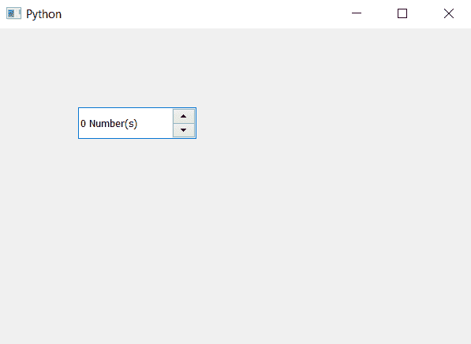

# pyqt 5 qscupbox–设置后缀

> 原文:[https://www . geesforgeks . org/pyqt 5-qspinbox-setting-后缀/](https://www.geeksforgeeks.org/pyqt5-qspinbox-setting-suffix/)

在这篇文章中，我们将看到如何设置后缀到旋转框，后缀是在值的末尾添加的额外文本，它是不可编辑和永久的。默认情况下，旋转框没有设置后缀，尽管我们可以随时设置后缀。

为了做到这一点，我们将使用`setSuffix`方法

> **语法:**旋转框.设置后缀(文本)
> 
> **自变量:**以字符串为自变量
> 
> **返回:**返回无

下面是实现

```
# importing libraries
from PyQt5.QtWidgets import * 
from PyQt5 import QtCore, QtGui
from PyQt5.QtGui import * 
from PyQt5.QtCore import * 
import sys

class Window(QMainWindow):

    def __init__(self):
        super().__init__()

        # setting title
        self.setWindowTitle("Python ")

        # setting geometry
        self.setGeometry(100, 100, 600, 400)

        # calling method
        self.UiComponents()

        # showing all the widgets
        self.show()

    # method for widgets
    def UiComponents(self):

        # creating spin box
        self.spin = QSpinBox(self)

        # setting geometry to spin box
        self.spin.setGeometry(100, 100, 150, 40)

        # setting step type
        self.spin.setSuffix(" Number(s)")

# create pyqt5 app
App = QApplication(sys.argv)

# create the instance of our Window
window = Window()

# start the app
sys.exit(App.exec())
```

**输出:**
