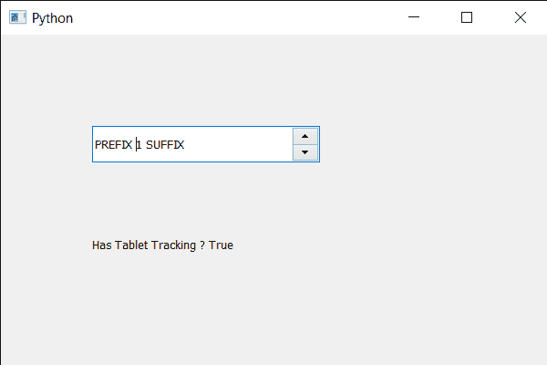

# PyQt5 QSpinBox–设置平板电脑跟踪

> 原文:[https://www . geeksforgeeks . org/pyqt 5-qspinbox-setting-table t-tracking/](https://www.geeksforgeeks.org/pyqt5-qspinbox-setting-tablet-tracking/)

在本文中，我们将了解如何将平板电脑跟踪设置为旋转框。默认情况下，平板电脑跟踪处于禁用状态，尽管我们可以随时更改。如果关闭了平板电脑跟踪，只有当手写笔与平板电脑接触，或者在移动手写笔时按下至少一个手写笔按钮时，才会发生平板电脑移动事件。如果打开了平板电脑跟踪，即使手写笔悬停在平板电脑附近，没有按下按钮，平板电脑也会发生移动事件。

为了做到这一点，我们对旋转框对象使用`setTabletTracking`方法。

> **语法:**旋转框。设置跟踪(真)
> 
> **自变量:**它以布尔为自变量
> 
> **返回:**返回无

下面是实现

```
# importing libraries
from PyQt5.QtWidgets import * 
from PyQt5 import QtCore, QtGui
from PyQt5.QtGui import * 
from PyQt5.QtCore import * 
import sys

class Window(QMainWindow):

    def __init__(self):
        super().__init__()

        # setting title
        self.setWindowTitle("Python ")

        # setting geometry
        self.setGeometry(100, 100, 600, 400)

        # calling method
        self.UiComponents()

        # showing all the widgets
        self.show()

        # method for widgets
    def UiComponents(self):
        # creating spin box
        self.spin = QSpinBox(self)

        # setting tablet tracking to the spin box
        self.spin.setTabletTracking(True)

        # setting geometry to spin box
        self.spin.setGeometry(100, 100, 250, 40)

        # setting range to the spin box
        self.spin.setRange(1, 999999)

        # setting prefix to spin
        self.spin.setPrefix("PREFIX ")

        # setting suffix to spin
        self.spin.setSuffix(" SUFFIX")

        # creating a label
        label = QLabel(self)

        # making the label multi line
        label.setWordWrap(True)

        # setting geometry to the label
        label.setGeometry(100, 200, 200, 60)

        # checking if spin box has tablet tracking
        check = self.spin.hasTabletTracking()

        # setting text to the label
        label.setText("Has Tablet Tracking ? " + str(check))

# create pyqt5 app
App = QApplication(sys.argv)

# create the instance of our Window
window = Window()

# start the app
sys.exit(App.exec())
```

**输出:**
