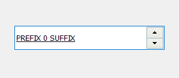
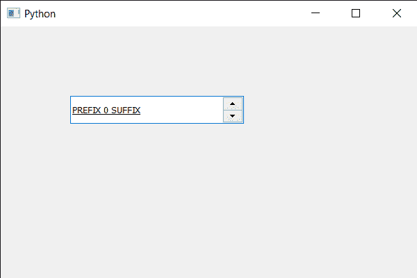

# PyQt5 QSpinBox–线下设置

> 原文:[https://www . geesforgeks . org/pyqt 5-qspinbox-设置-线下/](https://www.geeksforgeeks.org/pyqt5-qspinbox-setting-under-line/)

在本文中，我们将看到如何设置旋转框的底线。下划线，也称为下划线，是书写部分正下方或多或少的水平线。手写或打字文档中使用单下划线和偶尔使用双下划线来强调关键文本。下面是旋转框下划线文本的外观



为了做到这一点，我们对旋转框的 QFont 对象使用`setUnderline`方法。

> **语法:**字体.设置下划线(真)
> 
> **自变量:**它以布尔为自变量
> 
> **返回:**返回无

下面是实现

```py
# importing libraries
from PyQt5.QtWidgets import * 
from PyQt5 import QtCore, QtGui
from PyQt5.QtGui import * 
from PyQt5.QtCore import * 
import sys

class Window(QMainWindow):

    def __init__(self):
        super().__init__()

        # setting title
        self.setWindowTitle("Python ")

        # setting geometry
        self.setGeometry(100, 100, 600, 400)

        # calling method
        self.UiComponents()

        # showing all the widgets
        self.show()

        # method for widgets
    def UiComponents(self):
        # creating spin box
        self.spin = QSpinBox(self)

        # setting geometry to spin box
        self.spin.setGeometry(100, 100, 250, 40)

        # setting range to the spin box
        self.spin.setRange(0, 999999)

        # setting prefix to spin
        self.spin.setPrefix("PREFIX ")

        # setting suffix to spin
        self.spin.setSuffix(" SUFFIX")

        # getting font of the spin box
        font = self.spin.font()

        # setting under line
        font.setUnderline(True)

        # reassigning this font to the spin box
        self.spin.setFont(font)

# create pyqt5 app
App = QApplication(sys.argv)

# create the instance of our Window
window = Window()

# start the app
sys.exit(App.exec())
```

**输出:**
