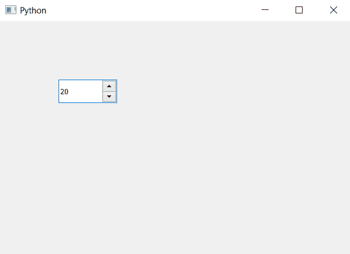

# PyQt5 QSpinBox–设定值

> 原文:[https://www.geeksforgeeks.org/pyqt5-qspinbox-setting-value/](https://www.geeksforgeeks.org/pyqt5-qspinbox-setting-value/)

在本文中，我们将了解如何为旋转框设置值。默认情况下，它的值为 0，尽管用户可以随时更改它。为了以编程方式更改其值，我们将使用`setValue`方法

> **语法:** spin.setValue(n)
> 
> **自变量:**以整数为自变量
> 
> **返回:**无

下面是实现

```py
# importing libraries
from PyQt5.QtWidgets import * 
from PyQt5 import QtCore, QtGui
from PyQt5.QtGui import * 
from PyQt5.QtCore import * 
import sys

class Window(QMainWindow):

    def __init__(self):
        super().__init__()

        # setting title
        self.setWindowTitle("Python ")

        # setting geometry
        self.setGeometry(100, 100, 600, 400)

        # calling method
        self.UiComponents()

        # showing all the widgets
        self.show()

    # method for widgets
    def UiComponents(self):

        # creating spin box
        self.spin = QSpinBox(self)

        # setting geometry to spin box
        self.spin.setGeometry(100, 100, 100, 40)

        # setting value to the spin box
        self.spin.setValue(20)

# create pyqt5 app
App = QApplication(sys.argv)

# create the instance of our Window
window = Window()

window.show()

# start the app
sys.exit(App.exec())
```

**输出:**
