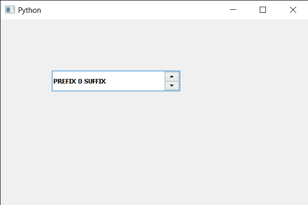

# PyQt5 QSpinBox–为文本设置权重

> 原文:[https://www . geeksforgeeks . org/pyqt 5-qspinbox-设置权重到文本/](https://www.geeksforgeeks.org/pyqt5-qspinbox-setting-weight-to-the-text/)

在本文中，我们将看到如何为旋转框的文本设置权重。字体粗细用于设置字体的粗细(粗细)。权重值越大，文本越粗。

为了做到这一点，我们对旋转框的 QFont 对象使用`setWeight`方法。

> **语法:**字体. setWeight(n)
> 
> **自变量:**以整数为自变量
> 
> **返回:**返回无

下面是实现

```
# importing libraries
from PyQt5.QtWidgets import * 
from PyQt5 import QtCore, QtGui
from PyQt5.QtGui import * 
from PyQt5.QtCore import * 
import sys

class Window(QMainWindow):

    def __init__(self):
        super().__init__()

        # setting title
        self.setWindowTitle("Python ")

        # setting geometry
        self.setGeometry(100, 100, 600, 400)

        # calling method
        self.UiComponents()

        # showing all the widgets
        self.show()

        # method for widgets
    def UiComponents(self):
        # creating spin box
        self.spin = QSpinBox(self)

        # setting geometry to spin box
        self.spin.setGeometry(100, 100, 250, 40)

        # setting range to the spin box
        self.spin.setRange(0, 999999)

        # setting prefix to spin
        self.spin.setPrefix("PREFIX ")

        # setting suffix to spin
        self.spin.setSuffix(" SUFFIX")

        # getting font of the spin box
        font = self.spin.font()

        # setting weight to the font
        font.setWeight(75)

        # reassigning this font to the spin box
        self.spin.setFont(font)

# create pyqt5 app
App = QApplication(sys.argv)

# create the instance of our Window
window = Window()

# start the app
sys.exit(App.exec())
```

**输出:**
