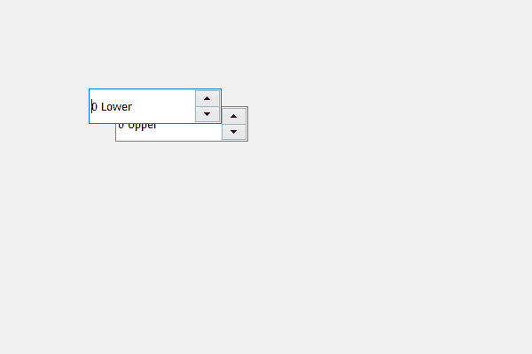

# PyQt5 QSpinBox–在上方显示

> 原文:[https://www . geesforgeks . org/pyqt5-qspinbox-showing-it-on-over-level/](https://www.geeksforgeeks.org/pyqt5-qspinbox-showing-it-on-above-level/)

在这篇文章中，我们将看到如何在上面的水平上创建旋转框，上面的水平意味着如果它与其他旋转框位置冲突，它将显示在顶部，默认情况下，当我们在相似的位置创建两个旋转框时，在末尾创建的旋转框将显示在顶部，尽管我们可以更改这一点。

为了做到这一点，我们将使用`raise_()`方法。

> **语法:**自旋 _box.raise_()
> 
> **论证:**不需要论证
> 
> **返回:**返回无

**注意:**此方法用于之前创建的旋转框

下面是实现

```py
# importing libraries
from PyQt5.QtWidgets import * 
from PyQt5 import QtCore, QtGui
from PyQt5.QtGui import * 
from PyQt5.QtCore import * 
import sys

class Window(QMainWindow):

    def __init__(self):
        super().__init__()

        # setting title
        self.setWindowTitle("Python ")

        # setting geometry
        self.setGeometry(100, 100, 600, 400)

        # calling method
        self.UiComponents()

        # showing all the widgets
        self.show()

    # method for widgets
    def UiComponents(self):

        # creating spin box
        self.spin = QSpinBox(self)

        # setting geometry to spin box
        self.spin.setGeometry(100, 100, 150, 40)

        # setting suffix to spin
        self.spin.setSuffix(" Lower")

        # creating spin box
        self.spin_upper = QSpinBox(self)

        # setting geometry to spin_upper
        self.spin_upper.setGeometry(130, 120, 150, 40)

        # setting suffix to spin_upper
        self.spin_upper.setSuffix(" Upper")

        # making spin rise above
        self.spin.raise_()

# create pyqt5 app
App = QApplication(sys.argv)

# create the instance of our Window
window = Window()

# start the app
sys.exit(App.exec())
```

**输出:**
