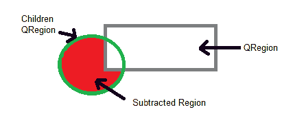
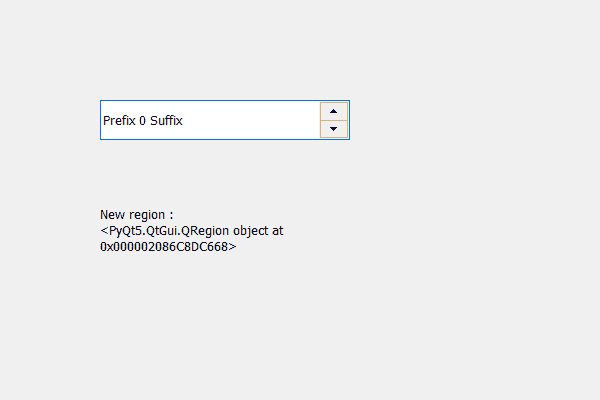

# PyQt5 QSpinBox–从子区域中减去区域

> 原文:[https://www . geeksforgeeks . org/pyqt 5-qspinbox-从孩子中减去区域-区域/](https://www.geeksforgeeks.org/pyqt5-qspinbox-subtracting-region-from-children-region/)

在本文中，我们将看到如何从旋转框的子区域中减去该区域，子区域保存旋转框的子区域所占据的组合区域。为了得到孩子区域，我们使用`childrenRegion`方法。下面是减去区域的外观。



> 为此，我们对旋转框的子区域对象使用减法
> 
> **语法:** children_region .减法(region)
> 
> **自变量:**它以 QRegion 对象为自变量
> 
> **返回:**返回无

下面是实现

```py
# importing libraries
from PyQt5.QtWidgets import * 
from PyQt5 import QtCore, QtGui
from PyQt5.QtGui import * 
from PyQt5.QtCore import * 
import sys

class Window(QMainWindow):

    def __init__(self):
        super().__init__()

        # setting title
        self.setWindowTitle("Python ")

        # setting geometry
        self.setGeometry(100, 100, 600, 400)

        # calling method
        self.UiComponents()

        # showing all the widgets
        self.show()

        # method for widgets

    def UiComponents(self):
        # creating spin box
        self.spin = QSpinBox(self)

        # setting geometry to spin box
        self.spin.setGeometry(100, 100, 250, 40)

        # setting range to the spin box
        self.spin.setRange(0, 999999)

        # setting prefix to spin
        self.spin.setPrefix("Prefix ")

        # setting suffix to spin
        self.spin.setSuffix(" Suffix")

        # getting the children region
        children_region = self.spin.childrenRegion()

        # creating a label
        label = QLabel(self)
        label.setWordWrap(True)

        # setting geometry to the label
        label.setGeometry(100, 200, 200, 60)

        # creating a region
        region = QRegion(QRect(1, 1, 20, 20))

        # subtracting a region
        children_region.subtracted(region)

        # setting text to the label
        label.setText("New region : " + str(children_region))

# create pyqt5 app
App = QApplication(sys.argv)

# create the instance of our Window
window = Window()
window.spin.setFocus()
# start the app
sys.exit(App.exec())
```

**输出:**
