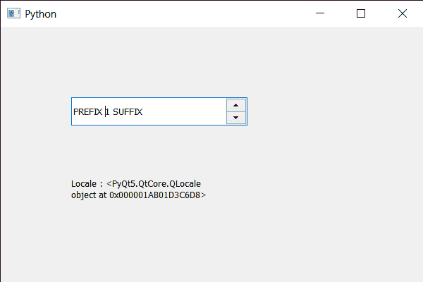

# pyqt 5 qspinbox-联合国局部

> 哎哎哎:# t0]https://www . geeksforgeeks . org/pyqt 5-qsparabolox-unset-locale/

在本文中，我们将看到如何取消旋转框的特殊区域设置。只要没有设置特殊的区域设置，微调框的区域设置要么是父控件的区域设置，要么如果给定的微调框是顶级小部件，那么它就有自己的默认区域设置。虽然我们也可以为旋转盒设置一个特殊的自定义。未设置特殊区域设置意味着自定义区域设置将被移除，默认区域设置将再次取而代之。

为了做到这一点，我们对旋转框对象使用`unsetLocale`方法。

> **语法:**旋转 _ 框.取消缩放()
> 
> **论证:**不需要论证
> 
> **返回:**返回无

下面是实现

```py
# importing libraries
from PyQt5.QtWidgets import * 
from PyQt5 import QtCore, QtGui
from PyQt5.QtGui import * 
from PyQt5.QtCore import * 
import sys

class Window(QMainWindow):

    def __init__(self):
        super().__init__()

        # setting title
        self.setWindowTitle("Python ")

        # setting geometry
        self.setGeometry(100, 100, 600, 400)

        # calling method
        self.UiComponents()

        # showing all the widgets
        self.show()

        # method for widgets
    def UiComponents(self):
        # creating spin box
        self.spin = QSpinBox(self)

        # setting geometry to spin box
        self.spin.setGeometry(100, 100, 250, 40)

        # setting range to the spin box
        self.spin.setRange(1, 999999)

        # setting prefix to spin
        self.spin.setPrefix("PREFIX ")

        # setting suffix to spin
        self.spin.setSuffix(" SUFFIX")

        # locale
        locale = QLocale()

        # setting locale to the spin box
        self.spin.setLocale(locale)

        # creating a label
        label = QLabel(self)

        # making the label multi line
        label.setWordWrap(True)

        # setting geometry to the label
        label.setGeometry(100, 200, 200, 60)

        # unset the special locale
        self.spin.unsetLocale()

        # getting the locale of the spin box
        value = self.spin.locale()

        # setting text to the label
        label.setText("Locale : " + str(value))

# create pyqt5 app
App = QApplication(sys.argv)

# create the instance of our Window
window = Window()

# start the app
sys.exit(App.exec())
```

**输出:**
