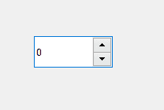

# pyqt 5 qsball box widget

> 哎哎哎:# t0]https://www . geeksforgeeks . org/pyqt 5-qsparabolox 小部件/

**QSpinBox** 是一个 PyQt5 小部件，它为用户提供了一个文本框，该文本框显示一个整数，其右侧有向上/向下按钮。如果按下向上/向下按钮，文本框中的值会增加/减少。默认最小值为 0，最大值为 99。



**示例:**
一个带有旋转框的窗口，当值改变时，会出现一条显示当前值的消息。

> 实施步骤–
> 
> 1.创建主窗口类
> 2。创建旋转盒部件
> 3。创建一个标签来显示价值
> 4。将动作添加到旋转框中，这样当值改变时，动作将被称为
> 5。在动作内将值设置为标签

下面是实现

```
# importing libraries
from PyQt5.QtWidgets import * 
from PyQt5 import QtCore, QtGui
from PyQt5.QtGui import * 
from PyQt5.QtCore import * 
import sys

class Window(QMainWindow):

    def __init__(self):
        super().__init__()

        # setting title
        self.setWindowTitle("Python ")

        # setting geometry
        self.setGeometry(100, 100, 600, 400)

        # calling method
        self.UiComponents()

        # showing all the widgets
        self.show()

    # method for widgets
    def UiComponents(self):

        # creating spin box
        self.spin = QSpinBox(self)

        # setting geometry to spin box
        self.spin.setGeometry(100, 100, 100, 40)

        # adding action to the spin box
        self.spin.valueChanged.connect(self.show_result)

        # creating label show result
        self.label = QLabel(self)

        # setting geometry
        self.label.setGeometry(100, 200, 200, 40)

    # method called by spin box
    def show_result(self):

        # setting value of spin box to the label
        self.label.setText("Value : " + str(self.spin.value()))

# create pyqt5 app
App = QApplication(sys.argv)

# create the instance of our Window
window = Window()

window.show()

# start the app
sys.exit(App.exec())
```

**输出:**

<video class="wp-video-shortcode" id="video-405595-1" width="640" height="428" preload="metadata" controls=""><source type="video/mp4" src="https://media.geeksforgeeks.org/wp-content/uploads/20200430110001/Python-30-04-2020-10_59_35.mp4?_=1">[https://media.geeksforgeeks.org/wp-content/uploads/20200430110001/Python-30-04-2020-10_59_35.mp4](https://media.geeksforgeeks.org/wp-content/uploads/20200430110001/Python-30-04-2020-10_59_35.mp4)</video>