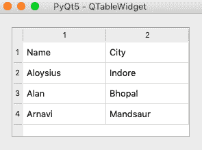

# pyqt 5–qtable widget

> 哎哎哎:# t0]https://www . geeksforgeeks . org/pyqt 5-qtable widget/

在本文中，我们将学习如何在我们的 [PyQt5](https://www.geeksforgeeks.org/python-introduction-to-pyqt5/) 应用程序中添加和使用表格。表是按行和列排列的数据，广泛用于通信、研究和数据分析。我们可以使用 **QTableWidget** 在 PyQt 应用程序中添加一个或多个表。

为了更好地理解这个概念，我们将举一个例子，在我们的应用程序中，我们希望在一个表中显示不同人的姓名和城市。我们可以从数据库、JSON 文件或任何其他存储平台中提取数据。

**示例:**

```
import sys
from PyQt5.QtWidgets import * 

#Main Window
class App(QWidget):
    def __init__(self):
        super().__init__()
        self.title = 'PyQt5 - QTableWidget'
        self.left = 0
        self.top = 0
        self.width = 300
        self.height = 200

        self.setWindowTitle(self.title)
        self.setGeometry(self.left, self.top, self.width, self.height)

        self.createTable()

        self.layout = QVBoxLayout()
        self.layout.addWidget(self.tableWidget)
        self.setLayout(self.layout)

        #Show window
        self.show()

    #Create table
    def createTable(self):
        self.tableWidget = QTableWidget()

        #Row count
        self.tableWidget.setRowCount(4) 

        #Column count
        self.tableWidget.setColumnCount(2)  

        self.tableWidget.setItem(0,0, QTableWidgetItem("Name"))
        self.tableWidget.setItem(0,1, QTableWidgetItem("City"))
        self.tableWidget.setItem(1,0, QTableWidgetItem("Aloysius"))
        self.tableWidget.setItem(1,1, QTableWidgetItem("Indore"))
        self.tableWidget.setItem(2,0, QTableWidgetItem("Alan"))
        self.tableWidget.setItem(2,1, QTableWidgetItem("Bhopal"))
        self.tableWidget.setItem(3,0, QTableWidgetItem("Arnavi"))
        self.tableWidget.setItem(3,1, QTableWidgetItem("Mandsaur"))

        #Table will fit the screen horizontally
        self.tableWidget.horizontalHeader().setStretchLastSection(True)
        self.tableWidget.horizontalHeader().setSectionResizeMode(
            QHeaderView.Stretch)

if __name__ == '__main__':
    app = QApplication(sys.argv)
    ex = App()
    sys.exit(app.exec_())
```

**输出:**

