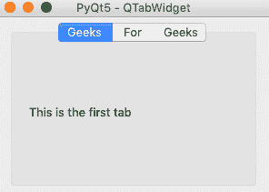

# pyqt 5–预算金额

> 哎哎哎:# t0]https://www . geeksforgeeks . org/pyqt 5-qtext dget/

在本文中，您将学习如何在您的 [PyQt5](https://www.geeksforgeeks.org/python-introduction-to-pyqt5/) 应用程序中添加和使用选项卡窗口。每个选项卡都有不同的布局，选定选项卡下的页面会显示出来，而其他选项卡会隐藏起来。要选择一个选项卡，您需要从这个 **QTabWidget** 提供的选项卡栏中单击所需的选项卡。

下面的文章描述了创建一个示例应用程序的过程，该应用程序有三个选项卡，每个选项卡都有不同的布局。
**例:**

```py
import sys
from PyQt5.QtWidgets import QMainWindow, QApplication, QPushButton, QWidget, QAction, QTabWidget, QVBoxLayout, QLabel

# Creating the main window
class App(QMainWindow):
    def __init__(self):
        super().__init__()
        self.title = 'PyQt5 - QTabWidget'
        self.left = 0
        self.top = 0
        self.width = 300
        self.height = 200
        self.setWindowTitle(self.title)
        self.setGeometry(self.left, self.top, self.width, self.height)

        self.tab_widget = MyTabWidget(self)
        self.setCentralWidget(self.tab_widget)

        self.show()

# Creating tab widgets
class MyTabWidget(QWidget):
    def __init__(self, parent):
        super(QWidget, self).__init__(parent)
        self.layout = QVBoxLayout(self)

        # Initialize tab screen
        self.tabs = QTabWidget()
        self.tab1 = QWidget()
        self.tab2 = QWidget()
        self.tab3 = QWidget()
        self.tabs.resize(300, 200)

        # Add tabs
        self.tabs.addTab(self.tab1, "Geeks")
        self.tabs.addTab(self.tab2, "For")
        self.tabs.addTab(self.tab3, "Geeks")

        # Create first tab
        self.tab1.layout = QVBoxLayout(self)
        self.l = QLabel()
        self.l.setText("This is the first tab")
        self.tab1.layout.addWidget(self.l)
        self.tab1.setLayout(self.tab1.layout)

        # Add tabs to widget
        self.layout.addWidget(self.tabs)
        self.setLayout(self.layout)

if __name__ == '__main__':
    app = QApplication(sys.argv)
    ex = App()
    sys.exit(app.exec_())
```

**输出:**


如果您想在任何选项卡上添加图标。你只需要更换

```py
self.tabs.addTab(self.tab1, "Geeks")
```

随着

```py
self.tabs.addTab(self.tab1, QIcon("Location of the icon"), ('Geeks')) 
```

并从`PyQt5.QtWidgets`导入`QIcon`库。