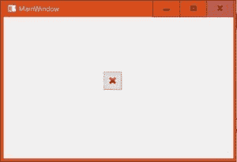

# pyqt 5 qtoolbutation

> 哎哎哎:# t0]https://www . geeksforgeeks . org/pyqt 5-qtol button/

**工具按钮**是一个 PyQt5 小部件，看起来像工具栏中使用的按钮。这个按钮包含一个图标，它给出了关于它的效用的想法。在应用程序中添加该按钮时，使用`QToolButton class`。


**示例:**

具有带退出图标的工具按钮的窗口。当用户点击此按钮时，应用程序关闭。

```py
import sys
from PyQt5 import QtCore, QtGui, QtWidgets

class Ui_MainWindow(object):
    def setupUi(self, MainWindow):
        MainWindow.resize(506, 312)
        self.centralwidget = QtWidgets.QWidget(MainWindow)
        self.centralwidget.setObjectName("centralwidget")

        self.toolButton = QtWidgets.QToolButton(self.centralwidget)
        self.toolButton.setGeometry(QtCore.QRect(220, 120, 41, 41))

        icon = QtGui.QIcon()
        icon.addPixmap(QtGui.QPixmap("exiticon.png [exact location of image]"),
                                          QtGui.QIcon.Normal, QtGui.QIcon.Off)

        # adding icon to the toolbutton
        self.toolButton.setIcon(icon)
        MainWindow.setCentralWidget(self.centralwidget)

        self.retranslateUi(MainWindow)
        QtCore.QMetaObject.connectSlotsByName(MainWindow)

        # adding signal and slot 
        self.toolButton.clicked.connect(self.exitapp)

    def retranslateUi(self, MainWindow):
        _translate = QtCore.QCoreApplication.translate
        MainWindow.setWindowTitle(_translate("MainWindow", "MainWindow"))

    # For closing the application
    def exitapp(self):
        sys.exit()

if __name__ == "__main__": 
    app = QtWidgets.QApplication(sys.argv) 

    MainWindow = QtWidgets.QMainWindow() 
    ui = Ui_MainWindow() 
    ui.setupUi(MainWindow) 
    MainWindow.show() 
    sys.exit(app.exec_()) 

```

**输出:**


当用户点击此按钮时，应用程序关闭。