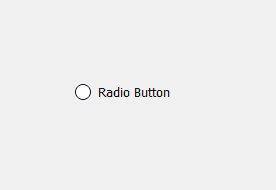
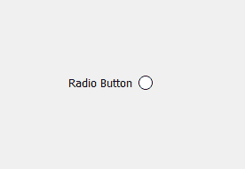
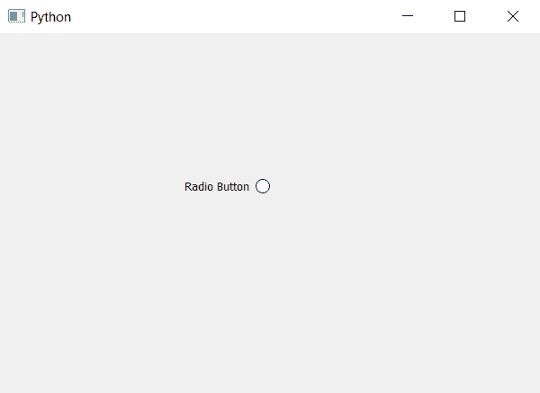

# PyQt5–右侧单选按钮指示器

> 原文:[https://www . geesforgeks . org/pyqt 5-右侧单选按钮-指示器/](https://www.geeksforgeeks.org/pyqt5-radio-button-indicator-at-right-side/)

在本文中，我们将看到如何在右侧制作单选按钮指示器。默认情况下，当我们创建一个单选按钮时，它的指示器位于左侧。单选按钮的指示器是圆形的可检查部分，表示它是否被检查。

下图是普通单选按钮与指示器位于右侧的单选按钮。
 

> **为了制作这种类型的小部件，我们必须执行以下操作–**
> 
> 1.使用 QRadioButton 类创建单选按钮。
> 2。借助`setLayoutDirection`改变其布局方向，默认为从左到右，设置为从右到左。

下面是实现。

```
# importing libraries
from PyQt5.QtWidgets import * 
from PyQt5 import QtCore, QtGui
from PyQt5.QtGui import * 
from PyQt5.QtCore import * 
import sys

class Window(QMainWindow):

    def __init__(self):
        super().__init__()

        # setting title
        self.setWindowTitle("Python ")

        # setting geometry
        self.setGeometry(100, 100, 600, 400)

        # calling method
        self.UiComponents()

        # showing all the widgets
        self.show()

    # method for widgets
    def UiComponents(self):

        # creating a radio button
        radio_button = QRadioButton("Radio Button", self)

        # setting geometry of radio button
        radio_button.setGeometry(200, 150, 100, 40)

        # setting layout direction of radio button
        radio_button.setLayoutDirection(Qt.RightToLeft)

# create pyqt5 app
App = QApplication(sys.argv)

# create the instance of our Window
window = Window()

# start the app
sys.exit(App.exec())
```

**输出:**
