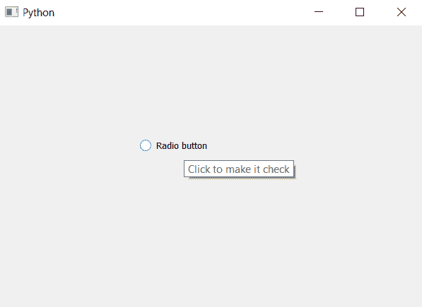

# pyqt 5–收音机按钮工具提示

> 哎哎哎::1230【https://www . geeksforgeeks . org/pyqt 5-radio button-tooltip/

在本文中，我们将了解如何将工具提示设置为单选按钮。工具提示基本上是我们将鼠标悬停在单选按钮上时出现的消息，工具提示给出了提示并帮助用户更好地了解单选按钮。

为了将工具提示设置为单选按钮，我们将使用`setToolTip`方法。

> **语法:**单选按钮.设置工具提示(文本)
> 
> **自变量:**以字符串为自变量
> 
> **执行的操作:**这将把工具提示设置为单选按钮

以下是实施–

```
# importing libraries
from PyQt5.QtWidgets import * 
from PyQt5 import QtCore, QtGui
from PyQt5.QtGui import * 
from PyQt5.QtCore import * 
import sys

class Window(QMainWindow):

    def __init__(self):
        super().__init__()

        # setting title
        self.setWindowTitle("Python ")

        # setting geometry
        self.setGeometry(100, 100, 600, 400)

        # calling method
        self.UiComponents()

        # showing all the widgets
        self.show()

    # method for widgets
    def UiComponents(self):
        # creating a radio button
        self.radio_button = QRadioButton("Radio button", self)

        # setting geometry of radio button
        self.radio_button.setGeometry(200, 150, 120, 40)

        # setting tool tip
        self.radio_button.setToolTip("Click to make it check")

# create pyqt5 app
App = QApplication(sys.argv)

# create the instance of our Window
window = Window()

# start the app
sys.exit(App.exec())
```

**输出:**
