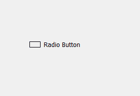
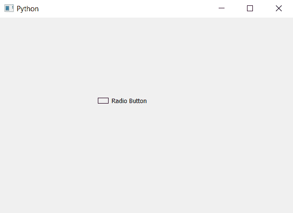

# PyQt5–矩形指示器单选按钮

> 原文:[https://www . geesforgeks . org/pyqt 5-矩形-指示器-单选按钮/](https://www.geeksforgeeks.org/pyqt5-rectangular-indicator-radio-button/)

在本文中，我们将看到如何制作单选按钮的矩形指示器。默认情况下，单选按钮指示器是圆形的。

下面是普通单选按钮和指示器为矩形的单选按钮的图示。
 

为此，我们必须更改与单选按钮对象关联的指示器的样式表代码，下面是样式表代码。

```
QRadioButton::indicator
{
border : 1px solid black;
width : 20px;
height : 10px;
border-radius : 1px;
}

```

下面是实现

```
# importing libraries
from PyQt5.QtWidgets import * 
from PyQt5 import QtCore, QtGui
from PyQt5.QtGui import * 
from PyQt5.QtCore import * 
import sys

class Window(QMainWindow):

    def __init__(self):
        super().__init__()

        # setting title
        self.setWindowTitle("Python ")

        # setting geometry
        self.setGeometry(100, 100, 600, 400)

        # calling method
        self.UiComponents()

        # showing all the widgets
        self.show()

    # method for widgets
    def UiComponents(self):

        # creating a radio button
        self.radio_button = QRadioButton(self)

        # setting geometry of radio button
        self.radio_button.setGeometry(200, 150, 120, 40)

        # setting text to radio button
        self.radio_button.setText("Radio Button")

        # changing style sheet code of radio button
        # setting border to indicator of thickness 1px and of black color
        # and width and height and the border radius equal to thickness of border
        self.radio_button.setStyleSheet("QRadioButton::indicator"
                                        "{"
                                        "border : 1px solid black;"
                                        "width : 20px;"
                                        "height : 10px;"
                                        "border-radius : 1px;"
                                        "}")

# create pyqt5 app
App = QApplication(sys.argv)

# create the instance of our Window
window = Window()

# start the app
sys.exit(App.exec())
```

**输出:**
