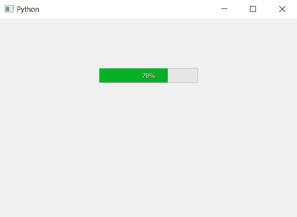

# 进度条的 PyQt5–reset format()方法

> 原文:[https://www . geesforgeks . org/pyqt 5-reset format-method-for-progress-bar/](https://www.geeksforgeeks.org/pyqt5-resetformat-method-for-progress-bar/)

我们知道我们可以使用`setFormat`方法设置格式，格式允许我们设置格式，如百分比或进度条的文本。`resetFormat`方法用于清除进度条的所有格式，并将其设置回默认值，即“%p%”，即百分比值+百分比符号。

> **语法:** bar.resetFormat()
> 
> **论证:**不需要论证。
> 
> **执行的操作:**将清除该进度条之前的所有格式，并将其设置为默认值。

下面是这个方法的实现。

```
# importing libraries
from PyQt5.QtWidgets import * 
from PyQt5 import QtCore, QtGui
from PyQt5.QtGui import * 
from PyQt5.QtCore import * 
import sys

class Window(QMainWindow):

    def __init__(self):
        super().__init__()

        # setting title
        self.setWindowTitle("Python ")

        # setting geometry
        self.setGeometry(100, 100, 600, 400)

        # calling method
        self.UiComponents()

        # showing all the widgets
        self.show()

    # method for widgets
    def UiComponents(self):
        # creating progress bar
        bar = QProgressBar(self)

        # setting geometry to progress bar
        bar.setGeometry(200, 100, 200, 30)

        # setting the value
        bar.setValue(70)

        # setting formatting to display text
        bar.setFormat("Geeks")

        # setting alignment to center
        bar.setAlignment(Qt.AlignCenter)

        # clearing the format
        # setting it back to defaults
        bar.resetFormat()

App = QApplication(sys.argv)

# create the instance of our Window
window = Window()

# start the app
sys.exit(App.exec())
```

**输出:**
