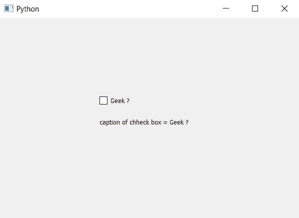

# PyQt5–检索复选框

的标题

> 原文:[https://www . geesforgeks . org/pyqt 5-检索-复选框标题/](https://www.geeksforgeeks.org/pyqt5-retrieving-caption-of-check-box/)

在本文中，我们将看到如何检索复选框的标题。当我们创建一个复选框时，我们可以选择将标题设置为复选框，或者在 setText 的帮助下，我们可以设置或更改标题。
为了检索标题，我们将使用文本方法。

> **语法:** checkbox.text()
> **参数:**不需要参数。
> **返回:**返回字符串。

下面是实现。

## 蟒蛇 3

```
# importing libraries
from PyQt5.QtWidgets import *
from PyQt5 import QtCore, QtGui
from PyQt5.QtGui import *
from PyQt5.QtCore import *
import sys

class Window(QMainWindow):

    def __init__(self):
        super().__init__()

        # setting title
        self.setWindowTitle("Python ")

        # setting geometry
        self.setGeometry(100, 100, 600, 400)

        # calling method
        self.UiComponents()

        # showing all the widgets
        self.show()

    # method for widgets
    def UiComponents(self):

        # creating the check-box
        checkbox = QCheckBox('Geek ?', self)

        # setting geometry of check box
        checkbox.setGeometry(200, 150, 100, 30)

        # getting the caption
        caption = checkbox.text()

        # creating label to print the
        label = QLabel("caption of check box = " +
                                     caption, self)

        # adjusting the size of label
        label.adjustSize()

        # moving the label
        label.move(200, 200)

# create pyqt5 app
App = QApplication(sys.argv)

# create the instance of our Window
window = Window()

# start the app
sys.exit(App.exec())
```

**输出:**

