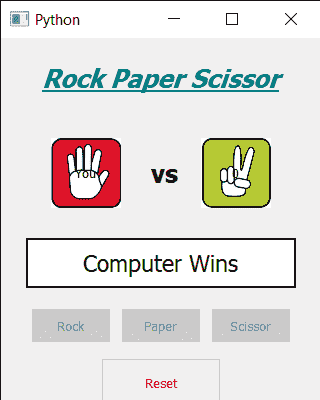

# PyQt5–石头纸和剪刀游戏

> 原文:[https://www . geeksforgeeks . org/pyqt 5-石头纸剪刀游戏/](https://www.geeksforgeeks.org/pyqt5-rock-paper-and-scissor-game/)

在本文中，我们将看到如何使用 PyQt5 创建一个石头纸和剪刀游戏。**石头剪刀布**是一种通常在两个人之间进行的手游，每个玩家同时用伸出的手形成三种形状中的一种。这些形状是“岩石”、“纸”和“剪刀”。下面是游戏的外观。



> **GUI 实现步骤:**
> 1。创建一个显示游戏标题的标题标签，设置其字体和属性
> 2。在头部标签下方创建一个用户标签，显示用户
> 3 选择的手势。创建一个计算机标签，显示由计算机选择的手形符号
> 4。在用户和计算机标签之间创建一个标签来显示文本“vs”
> 5。创建一个结果标签，向其显示结果集字体和其他属性
> 6。分别为岩石、纸张和剪刀创建三个按钮
> 7。创建一个重置按钮来重置游戏
> 
> **后端实现步骤:**
> 1。创建用户选择和计数器变量，将其值设置为-1
> 2。给石头、纸张和剪刀按钮添加动作
> 3。在动作中，根据按下的按钮设置选择值，并将计数器值设置为 3，并使所有三个按钮禁用
> 4。每隔一秒钟创建一个调用方法的定时器对象
> 5。在计时器方法中，检查计数器值是否为-1，然后不做其他事情，将计数器值设置为计算机标签，并递减计数器
> 6。并检查计数器值是否等于 0，然后得到一个从 1 到 3 的随机值，根据值将手形符号设置到计算机标签
> 7。调用 who_win 方法得到结果
> 8。在 who_wins 方法中，首先检查匹配是否为平局，否则找到获胜者，并将获胜者设置为结果标签
> 9。给复位按钮
> 10 增加动作。在重置按钮操作中，将计数器值设置为-1，启用所有按钮，并从计算机和用户标签中删除图像

下面是实现

```py
# importing libraries
from PyQt5.QtWidgets import * 
from PyQt5 import QtCore, QtGui
from PyQt5.QtGui import * 
from PyQt5.QtCore import * 
import random
import sys

class Window(QMainWindow):

    def __init__(self):
        super().__init__()

        # setting title
        self.setWindowTitle("Python ")

        # setting geometry
        self.setGeometry(100, 100, 320, 400)

        # calling method
        self.UiComponents()

        # showing all the widgets
        self.show()

    # method for components
    def UiComponents(self):

        # counter variable
        self.counter = -1

        # choice variable
        self.choice = 0

        # creating head label
        head = QLabel("Rock Paper Scissor", self)

        # setting geometry to the head
        head.setGeometry(20, 10, 280, 60)

        # font
        font = QFont('Times', 15)
        font.setBold(True)
        font.setItalic(True)
        font.setUnderline(True)

        # setting font to the head
        head.setFont(font)

        # setting alignment of the head
        head.setAlignment(Qt.AlignCenter)

        # setting color effect to the head
        color = QGraphicsColorizeEffect(self)
        color.setColor(Qt.darkCyan)
        head.setGraphicsEffect(color)

        # creating a vs label
        self.vs = QLabel("vs", self)

        # setting geometry
        self.vs.setGeometry(150, 110, 30, 50)

        # setting font
        font.setUnderline(False)
        font.setItalic(False)
        self.vs.setFont(font)

        # creating your choice label
        self.user = QLabel("You", self)

        # setting geometry
        self.user.setGeometry(50, 100, 70, 70)
        self.user.setStyleSheet("border : 2px solid black; background : white;")

        # setting alignment
        self.user.setAlignment(Qt.AlignCenter)

        # creating computer choice  label
        self.computer = QLabel("Computer", self)

        # setting geometry
        self.computer.setGeometry(200, 100, 70, 70)
        self.computer.setStyleSheet("border : 2px solid black; background : white;")

        # setting alignment
        self.computer.setAlignment(Qt.AlignCenter)

        # result label
        self.result = QLabel(self)

        # setting geometry to the result
        self.result.setGeometry(25, 200, 270, 50)

        # setting font
        self.result.setFont(QFont('Times', 14))

        # setting alignment
        self.result.setAlignment(Qt.AlignCenter)

        # setting border and color
        self.result.setStyleSheet("border : 2px solid black; background : white;")

        # creating three push button
        # for rock paper and scissor
        self.rock = QPushButton("Rock", self)
        self.rock.setGeometry(30, 270, 80, 35)

        self.paper = QPushButton("Paper", self)
        self.paper.setGeometry(120, 270, 80, 35)

        self.scissor = QPushButton("Scissor", self)
        self.scissor.setGeometry(210, 270, 80, 35)

        # adding actions to the buttons
        self.rock.clicked.connect(self.rock_action)
        self.paper.clicked.connect(self.paper_action)
        self.scissor.clicked.connect(self.scissor_action)

        # creating push button to reset all the game
        game_reset = QPushButton("Reset", self)

        # setting geometry
        game_reset.setGeometry(100, 320, 120, 50)

        # setting color effect
        color = QGraphicsColorizeEffect(self)
        color.setColor(Qt.red)
        game_reset.setGraphicsEffect(color)

        # adding action tot he reset button
        game_reset.clicked.connect(self.reset_action)

        # creating a timer object
        timer = QTimer(self)

        # adding action to the timer
        timer.timeout.connect(self.showTime)

        # starting the timer
        timer.start(1000)

    def showTime(self):

        # if counter value is - 1
        if self.counter == -1:
            pass

        # if counter is not - 1
        else:

            # setting counter value to the label
            self.computer.setText(str(self.counter))

            if self.counter == 0:
                self.comp_choice = random.randint(1, 3)

                # if computer choice is 1
                if self.comp_choice == 1:

                    # setting rock image to the computer label
                    self.computer.setStyleSheet("border-image : url(rock.png);")

                elif self.comp_choice == 2:
                    # setting paper image to the computer label
                    self.computer.setStyleSheet("border-image : url(Paper.png);")

                else:
                    # setting scissor image to the computer label
                    self.computer.setStyleSheet("border-image : url(scissor.png);")

                # checking who won the match
                self.who_won()

            # decrementing the counter value
            self.counter -= 1

    def rock_action(self):

        # making choice as 1
        self.choice = 1

        # setting rock image to the user label
        self.user.setStyleSheet("border-image : url(rock.png);")

        # making counter value to 3
        self.counter = 3

        # disabling the push button
        self.rock.setDisabled(True)
        self.paper.setDisabled(True)
        self.scissor.setDisabled(True)

    def paper_action(self):

        # making choice as 2
        self.choice = 2

        # setting rock image to the user label
        self.user.setStyleSheet("border-image : url(Paper.png);")

        # making counter value to 3
        self.counter = 3

        # disabling the push button
        self.rock.setDisabled(True)
        self.paper.setDisabled(True)
        self.scissor.setDisabled(True)

    def scissor_action(self):

        # making choice as 3
        self.choice = 3

        # setting rock image to the user label
        self.user.setStyleSheet("border-image : url(scissor.png);")

        # making counter value to 3
        self.counter = 3

        # disabling the push button
        self.rock.setDisabled(True)
        self.paper.setDisabled(True)
        self.scissor.setDisabled(True)

    def reset_action(self):

        # making result label empty
        self.result.setText("")

        # resting the counter value
        self.counter = -1

        # enabling the push buttons
        self.rock.setEnabled(True)
        self.paper.setEnabled(True)
        self.scissor.setEnabled(True)

        # removing images fro the user and computer label
        self.user.setStyleSheet("border-image : null;")
        self.computer.setStyleSheet("border-image : null;")

    def who_won(self):

        # if match is draw
        if self.choice == self.comp_choice:

            # setting text to the result label
            self.result.setText("Draw Match")

        else:
            # condition for winning
            # user choose rock
            if self.choice == 1:
                # computer choose paper
                if self.comp_choice == 2:
                    # setting text to the result
                    self.result.setText("Computer Wins")
                else:
                    self.result.setText("User Wins")

            # user chooses paper
            elif self.choice == 2:
                # computer choose scissor
                if self.comp_choice == 3:
                    # setting text to the result
                    self.result.setText("Computer Wins")
                else:
                    self.result.setText("User Wins")

            # if user chooses scissor
            elif self.choice == 3:
                # computer choose rock
                if self.comp_choice == 1:
                    # setting text to the result
                    self.result.setText("Computer Wins")
                else:
                    self.result.setText("User Wins")

# create pyqt5 app
App = QApplication(sys.argv)

# create the instance of our Window
window = Window()

# start the app
sys.exit(App.exec())
```

**输出:**

<video class="wp-video-shortcode" id="video-427488-1" width="640" height="800" preload="metadata" controls=""><source type="video/mp4" src="https://media.geeksforgeeks.org/wp-content/uploads/20200602004956/Python-2020-06-02-00-49-01.mp4?_=1">[https://media.geeksforgeeks.org/wp-content/uploads/20200602004956/Python-2020-06-02-00-49-01.mp4](https://media.geeksforgeeks.org/wp-content/uploads/20200602004956/Python-2020-06-02-00-49-01.mp4)</video>