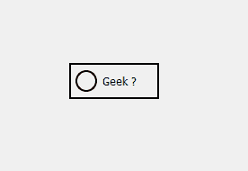

# PyQt5–复选框

的圆形指示器

> 原文:[https://www . geeksforgeeks . org/pyqt 5-轮选指标/](https://www.geeksforgeeks.org/pyqt5-round-indicator-of-checkbox/)

在本文中，我们将看到如何创建复选框的圆形指示器。默认情况下，复选框有方形指示器，尽管在样式表的帮助下，我们可以将其改为圆形。下面是正常指示器与复选框圆形指示器的图示。
 

**为了做到这一点，我们必须做到以下几点:**

1.  将边框设置为指示器，因为当我们尝试更改形状时，边框将消失，因此为了处理它，我们将为它提供自定义边框。
2.  设置指示器的大小，它应该是方形的。
3.  将边框半径设置为指示器长度的一半和边框厚度的总和，即
    `radius = width/2 + thickness`

**样式表代码–**

```
QCheckBox::indicator
{
border : 2px solid black;
width : 20px;
height : 20px;
border-radius : 22px;
}

```

以下是实施–

```
# importing libraries
from PyQt5.QtWidgets import * 
from PyQt5 import QtCore, QtGui
from PyQt5.QtGui import * 
from PyQt5.QtCore import * 
import sys

class Window(QMainWindow):

    def __init__(self):
        super().__init__()

        # setting title
        self.setWindowTitle("Python ")

        # setting geometry
        self.setGeometry(100, 100, 600, 400)

        # calling method
        self.UiComponents()

        # showing all the widgets
        self.show()

    # method for widgets
    def UiComponents(self):
        # creating the check-box
        checkbox = QCheckBox('Geek ?', self)

        # setting tristate check box
        checkbox.setTristate(True)

        # setting geometry of check box
        checkbox.setGeometry(200, 150, 100, 40)

        # adding border to the check box and padding
        # adding border to indicator and setting size
        # setting border radius
        checkbox.setStyleSheet("QCheckBox"
                               "{"
                               "border : 2px solid clack;"
                               "padding : 5px;"
                               "}"
                               "QCheckBox::indicator"
                               "{"
                               "border : 2px solid black;"
                               "width : 20px;"
                               "height : 20px;"
                               "border-radius :12px;"
                               "}")

# create pyqt5 app
App = QApplication(sys.argv)

# create the instance of our Window
window = Window()

# start the app
sys.exit(App.exec())
```

**输出:**
