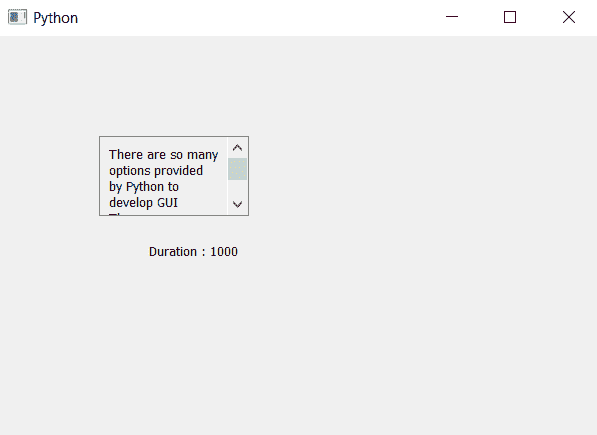

# PyQt5 可滚动标签–获取工具提示持续时间

> 原文:[https://www . geesforgeks . org/pyqt 5-可滚动-标签-获取-工具-提示-持续时间/](https://www.geeksforgeeks.org/pyqt5-scrollable-label-getting-tool-tip-duration/)

在本文中，我们将看到如何获得滚动标签的工具提示持续时间，可滚动标签是一个具有滚动功能的标签。

> 实施步骤–
> 
> 1.创建一个继承 QScrollArea
> 2 的新类。班级内部创建垂直布局
> 3。创建一个标签，使其多行，并将其添加到布局中
> 5。超越标签的设定文本和文本方法
> 6。在主窗口类中创建该类的对象，并为其设置文本
> 7。借助`setToolTip`方法
> 8 给对象添加工具提示。借助 setToolTipDuration 方法
> 9 给对象添加工具提示持续时间。借助 tooltip duration 方法
> 10 获取对象的工具提示持续时间。创建另一个标签来显示持续时间

下面是实现

```
# importing libraries
from PyQt5.QtWidgets import * 
from PyQt5 import QtCore, QtGui
from PyQt5.QtGui import * 
from PyQt5.QtCore import * 
import sys

# class for scrollable label
class ScrollLabel(QScrollArea):

    # constructor
    def __init__(self, *args, **kwargs):
        QScrollArea.__init__(self, *args, **kwargs)

        # making widget resizable
        self.setWidgetResizable(True)

        # making qwidget object
        content = QWidget(self)
        self.setWidget(content)

        # vertical box layout
        lay = QVBoxLayout(content)

        # creating label
        self.label = QLabel(content)

        # making label multi-line
        self.label.setWordWrap(True)

        # adding label to the layout
        lay.addWidget(self.label)

    # the setText method
    def setText(self, text):
        # setting text to the label
        self.label.setText(text)

    # getting text method
    def text(self):
        # getting text of the label
        get_text = self.label.text()

        # return the text
        return get_text

class Window(QMainWindow):

    def __init__(self):
        super().__init__()

        # setting title
        self.setWindowTitle("Python ")

        # setting geometry
        self.setGeometry(100, 100, 600, 400)

        # calling method
        self.UiComponents()

        # showing all the widgets
        self.show()

    # method for widgets
    def UiComponents(self):
        # text to show in label
        text = "There are so many options provided by Python to develop GUI " \
               " There are so many options provided by Python to develop GUI" \
               " There are so many options provided by Python to develop GUI"

        # creating scroll label
        label = ScrollLabel(self)

        # setting text to the label
        label.setText(text)

        # setting geometry
        label.setGeometry(100, 100, 150, 80)

        # setting tool tip
        label.setToolTip("It is tool tip")

        # setting tool tip duration
        label.setToolTipDuration(1000)

        # getting duration
        duration = label.toolTipDuration()

        # creating another label to show the duration
        result = QLabel("Duration : " + str(duration), self)

        # setting geometry to the label
        result.setGeometry(150, 200, 200, 30)

# create pyqt5 app
App = QApplication(sys.argv)

# create the instance of our Window
window = Window()

# start the app
sys.exit(App.exec())
```

**输出:**
