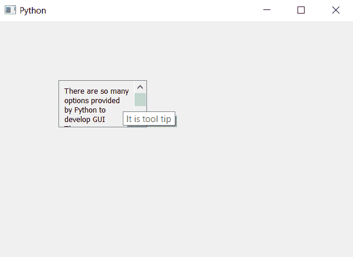

# PyQt5 可滚动标签–设置工具提示持续时间来标记零件

> 原文:[https://www . geesforgeks . org/pyqt 5-可滚动-标签-设置-工具-提示-持续时间-标签-零件/](https://www.geeksforgeeks.org/pyqt5-scrollable-label-setting-tool-tip-duration-to-label-part/)

在本文中，我们将看到如何将工具提示持续时间设置为滚动标签的标签部分，当我们知道我们可以通过继承一个滚动类并在其中制作标签来制作可滚动标签时，但是当我们将工具提示设置为类对象时，工具提示也将设置为整个小部件，即标签和滚动条。

为了将工具提示及其持续时间添加到标签部分，我们必须覆盖对象的功能。

> 实施步骤–
> 
> 1.创建一个继承 QScrollArea
> 2 的新类。班级内部创建垂直布局
> 3。创建一个标签，使其多行，并将其添加到布局
> 5。超越标签
> 6 的设置文本和文本方法。超程设置工具提示方法，并在标签上添加工具提示
> 7。超越设置工具持续时间方法添加持续时间标签
> 8。在主窗口类中创建该类的对象，并为其设置文本
> 9。借助`setToolTip`方法
> 10 给物体添加刀尖。借助`setToolTipDuration`方法为对象添加刀尖持续时间。

下面是实现

```
# importing libraries
from PyQt5.QtWidgets import * 
from PyQt5 import QtCore, QtGui
from PyQt5.QtGui import * 
from PyQt5.QtCore import * 
import sys

# class for scrollable label
class ScrollLabel(QScrollArea):

    # constructor
    def __init__(self, *args, **kwargs):
        QScrollArea.__init__(self, *args, **kwargs)

        # making widget resizable
        self.setWidgetResizable(True)

        # making qwidget object
        content = QWidget(self)
        self.setWidget(content)

        # vertical box layout
        lay = QVBoxLayout(content)

        # creating label
        self.label = QLabel(content)

        # making label multi-line
        self.label.setWordWrap(True)

        # adding label to the layout
        lay.addWidget(self.label)

    # the setText method
    def setText(self, text):
        # setting text to the label
        self.label.setText(text)

    # getting text method
    def text(self):
        # getting text of the label
        get_text = self.label.text()

        # return the text
        return get_text

    # setToolTip method
    def setToolTip(self, p_str):
        # setting tool tip to the label
        self.label.setToolTip(p_str)

    # setToolTipDuration method
    def setToolTipDuration(self, p_int):
        # setting tool tip duration to the label
        self.label.setToolTipDuration(p_int)

class Window(QMainWindow):

    def __init__(self):
        super().__init__()

        # setting title
        self.setWindowTitle("Python ")

        # setting geometry
        self.setGeometry(100, 100, 600, 400)

        # calling method
        self.UiComponents()

        # showing all the widgets
        self.show()

    # method for widgets
    def UiComponents(self):
        # text to show in label
        text = "There are so many options provided by Python to develop GUI " \
               " There are so many options provided by Python to develop GUI" \
               " There are so many options provided by Python to develop GUI"

        # creating scroll label
        label = ScrollLabel(self)

        # setting text to the label
        label.setText(text)

        # setting geometry
        label.setGeometry(100, 100, 150, 80)

        # setting tool tip
        label.setToolTip("It is tool tip")

        # setting tool tip duration
        label.setToolTipDuration(1000)

# create pyqt5 app
App = QApplication(sys.argv)

# create the instance of our Window
window = Window()

# start the app
sys.exit(App.exec())
```

**输出:**


这个工具提示将在 1000 毫秒后消失