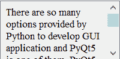

# pyqt 5–滚动标签

> 原文:[https://www.geeksforgeeks.org/pyqt5-scrollable-label/](https://www.geeksforgeeks.org/pyqt5-scrollable-label/)

在这篇文章中，我们将看到如何创建一个可滚动的标签，默认情况下，当我们创建一个标签时，所有的文本都在单行中，如果文本长度大于标签，额外的文本不会显示，尽管在 setWordWrap 方法的帮助下，我们可以创建一个多行标签，但是如果文本超过它，它将不会显示在标签中。
为了在一个小标签中显示整个文本，我们必须使标签可滚动，为此，我们必须创建自己的可滚动标签类，该类继承了允许我们使标签可滚动的 QScrollArea 类，下面是可滚动标签的外观



> 为此，我们必须执行以下操作–
> 1。创建一个继承 QScrollArea
> 2 的新类。班级内部创建垂直布局
> 3。创建标签
> 4。使标签多行
> 5。超越标签
> 6 的设置文本方法。在主窗口类中创建该类的对象并为其设置文本

**滚动标签类语法**

```
class ScrollLabel(QScrollArea):

    # constructor
    def __init__(self, *args, **kwargs):
        QScrollArea.__init__(self, *args, **kwargs)

        # making widget resizable
        self.setWidgetResizable(True)

        # making qwidget object
        content = QWidget(self)
        self.setWidget(content)

        # vertical box layout
        lay = QVBoxLayout(content)

        # creating label
        self.label = QLabel(content)

        # setting alignment to the text
        self.label.setAlignment(Qt.AlignLeft | Qt.AlignTop)

        # making label multi-line
        self.label.setWordWrap(True)

        # adding label to the layout
        lay.addWidget(self.label)

    # the setText method
    def setText(self, text):
        # setting text to the label
        self.label.setText(text)
```

下面是实现

## 蟒蛇 3

```
# importing libraries
from PyQt5.QtWidgets import *
from PyQt5 import QtCore, QtGui
from PyQt5.QtGui import *
from PyQt5.QtCore import *
import sys

# class for scrollable label
class ScrollLabel(QScrollArea):

    # constructor
    def __init__(self, *args, **kwargs):
        QScrollArea.__init__(self, *args, **kwargs)

        # making widget resizable
        self.setWidgetResizable(True)

        # making qwidget object
        content = QWidget(self)
        self.setWidget(content)

        # vertical box layout
        lay = QVBoxLayout(content)

        # creating label
        self.label = QLabel(content)

        # setting alignment to the text
        self.label.setAlignment(Qt.AlignLeft | Qt.AlignTop)

        # making label multi-line
        self.label.setWordWrap(True)

        # adding label to the layout
        lay.addWidget(self.label)

    # the setText method
    def setText(self, text):
        # setting text to the label
        self.label.setText(text)

class Window(QMainWindow):

    def __init__(self):
        super().__init__()

        # setting title
        self.setWindowTitle("Python ")

        # setting geometry
        self.setGeometry(100, 100, 600, 400)

        # calling method
        self.UiComponents()

        # showing all the widgets
        self.show()

    # method for widgets
    def UiComponents(self):
        # text to show in label
        text = "There are so many options provided by Python to develop GUI " \
               "application and PyQt5 is one of them. PyQt5 is cross-platform " \
               "GUI toolkit, a set of python bindings for Qt v5\. One can develop" \
               " an interactive desktop application with so much ease because " \
               "of the tools and simplicity provided by this library.A GUI application" \
               " consists of Front-end and Back-end. PyQt5 has provided a tool called " \
               "‘QtDesigner’ to design the front-end by drag and drop method so that " \
               "development can become faster and one can give more time on back-end stuff. "

        # creating scroll label
        label = ScrollLabel(self)

        # setting text to the label
        label.setText(text)

        # setting geometry
        label.setGeometry(100, 100, 200, 80)

# create pyqt5 app
App = QApplication(sys.argv)

# create the instance of our Window
window = Window()

window.show()

# start the app
sys.exit(App.exec())
```

**输出:**

<video class="wp-video-shortcode" id="video-404521-1" width="640" height="360" preload="metadata" controls=""><source type="video/mp4" src="https://media.geeksforgeeks.org/wp-content/uploads/20200428020903/Python-28-04-2020-02_08_26.mp4?_=1">[https://media.geeksforgeeks.org/wp-content/uploads/20200428020903/Python-28-04-2020-02_08_26.mp4](https://media.geeksforgeeks.org/wp-content/uploads/20200428020903/Python-28-04-2020-02_08_26.mp4)</video>