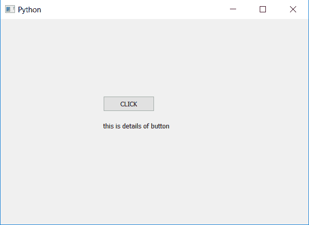

# PyQt5–按钮

的设置和访问说明

> 原文:[https://www . geesforgeks . org/pyqt 5-按钮设置和访问描述/](https://www.geeksforgeeks.org/pyqt5-set-and-access-description-of-push-button/)

在本文中，我们将看到如何设置和访问按钮的描述。描述基本上是关于按钮的细节，即细节是指描述按钮的文本。为了设置描述，我们将使用`setAccessibleDescription`方法，为了访问描述，我们将使用`accessibleDescription`方法。

> **语法:**
> 
> ```py
> button.setAccessibleDescription(info)
> button.accessibleDescription()
> 
> ```
> 
> **论证:**
> 以弦为论证。
> `accessibleDescription`无需争论。
> 
> **返回:**
> 返回无
> `accessibleDescription`返回字符串

**代码:**

```py
# importing libraries
from PyQt5.QtWidgets import * 
from PyQt5.QtGui import * 
from PyQt5.QtCore import * 
import sys

class Window(QMainWindow):
    def __init__(self):
        super().__init__()

        # setting title
        self.setWindowTitle("Python ")

        # setting geometry
        self.setGeometry(100, 100, 600, 400)

        # calling method
        self.UiComponents()

        # showing all the widgets
        self.show()

    # method for widgets
    def UiComponents(self):

        # creating a push button
        button = QPushButton("CLICK", self)

        # setting geometry of button
        button.setGeometry(200, 150, 100, 30)

        # adding action to a button
        button.clicked.connect(self.clickme)

        # setting the description
        button.setAccessibleDescription("this is details of button")

        # accessing the description
        info = button.accessibleDescription()

        # creating label to display info
        label = QLabel(info, self)
        # moving the label
        label.move(200, 200)
        # adjusting the size of label
        label.adjustSize()

    # action method
    def clickme(self):

        # printing pressed
        print("pressed")

# create pyqt5 app
App = QApplication(sys.argv)

# create the instance of our Window
window = Window()

# start the app
sys.exit(App.exec())
```

**输出:**
