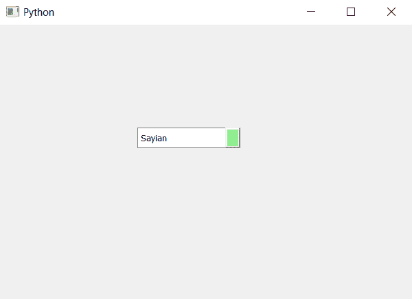

# PyQt5–将背景颜色设置为组合框的向下箭头

> 原文:[https://www . geeksforgeeks . org/pyqt 5-set-background-color-to-down-arrow of-combobox/](https://www.geeksforgeeks.org/pyqt5-set-background-color-to-down-arrow-of-combobox/)

在本文中，我们将看到如何设置组合框向下箭头的背景颜色。向下箭头是组合框的按钮部分，按下该按钮时会打开项目列表视图。

为了给向下箭头添加颜色，我们必须更改与组合框关联的样式表，下面是样式表代码

```
QComboBox::down-arrow
{
background-color : lightgreen;
}

```

下面是实现

```
# importing libraries
from PyQt5.QtWidgets import * 
from PyQt5 import QtCore, QtGui
from PyQt5.QtGui import * 
from PyQt5.QtCore import * 
import sys

class Window(QMainWindow):

    def __init__(self):
        super().__init__()

        # setting title
        self.setWindowTitle("Python ")

        # setting geometry
        self.setGeometry(100, 100, 600, 400)

        # calling method
        self.UiComponents()

        # showing all the widgets
        self.show()

    # method for widgets
    def UiComponents(self):

        # creating a combo box widget
        self.combo_box = QComboBox(self)

        # setting geometry of combo box
        self.combo_box.setGeometry(200, 150, 150, 30)

        # making combo box editable
        self.combo_box.setEditable(True)

        # geek list
        geek_list = ["Sayian", "Super Sayian", "Super Sayian 2", "Super Sayian B"]

        # adding list of items to combo box
        self.combo_box.addItems(geek_list)

        # editing style sheet code of combo box
        # adding background color to the down arrow
        self.combo_box.setStyleSheet("QComboBox::down-arrow"
                                     "{"
                                     "background-color : lightgreen;"
                                     "}")

# create pyqt5 app
App = QApplication(sys.argv)

# create the instance of our Window
window = Window()

# start the app
sys.exit(App.exec())
```

**输出:**
