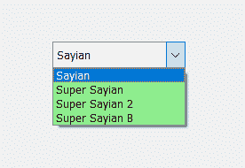
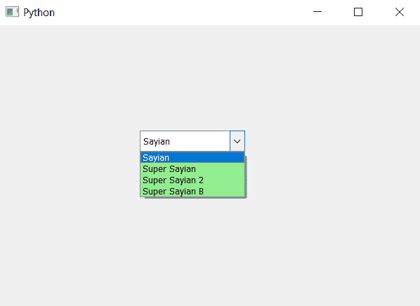

# PyQt5–设置背景颜色查看组合框的一部分

> 原文:[https://www . geeksforgeeks . org/pyqt 5-设置-背景色-查看-部分-组合框/](https://www.geeksforgeeks.org/pyqt5-set-background-color-to-view-part-of-combobox/)

在本文中，我们将看到如何为组合框的视图部分设置背景色。视图部分基本上是下拉项列表，里面显示了所有可用的项，我们已经借助`view`方法得到了视图对象，默认情况下组合框使用`QListView object`。下图是普通视图框和带颜色的视图框。

 

为了做到这一点，我们必须更改与组合框相关联的样式表，下面是实现这一点的样式表代码

```py
QListView
{
background-color : lightgreen;
}

```

下面是实现

```py
# importing libraries
from PyQt5.QtWidgets import * 
from PyQt5 import QtCore, QtGui
from PyQt5.QtGui import * 
from PyQt5.QtCore import * 
import sys

class Window(QMainWindow):

    def __init__(self):
        super().__init__()

        # setting title
        self.setWindowTitle("Python ")

        # setting geometry
        self.setGeometry(100, 100, 600, 400)

        # calling method
        self.UiComponents()

        # showing all the widgets
        self.show()

    # method for widgets
    def UiComponents(self):

        # creating a combo box widget
        self.combo_box = QComboBox(self)

        # setting geometry of combo box
        self.combo_box.setGeometry(200, 150, 150, 30)

        # making combo box editable
        self.combo_box.setEditable(True)

        # geek list
        geek_list = ["Sayian", "Super Sayian", "Super Sayian 2", "Super Sayian B"]

        # adding list of items to combo box
        self.combo_box.addItems(geek_list)

        # adding background color to the view part of combo box
        self.combo_box.setStyleSheet("QListView"
                                     "{"
                                     "background-color: lightgreen;"
                                     "}")

# create pyqt5 app
App = QApplication(sys.argv)

# create the instance of our Window
window = Window()

# start the app
sys.exit(App.exec())
```

**输出:**
