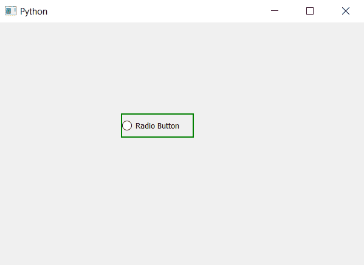

# PyQt5–将边框设置为单选按钮

> 原文:[https://www . geesforgeks . org/pyqt 5-设置边框到单选按钮/](https://www.geeksforgeeks.org/pyqt5-set-border-to-radio-button/)

在本文中，我们将看到如何设置单选按钮的边框。默认情况下，没有与单选按钮相关联的边框，尽管我们可以设置它。下面是普通单选按钮和带边框单选按钮的图示。
 

为了做到这一点，我们必须改变与单选按钮相关联的样式表，并且必须给它添加边框。下面是样式表代码。

```py
QRadioButton
{
border : 2px solid green;
}

```

下面是实现。

```py
# importing libraries
from PyQt5.QtWidgets import * 
from PyQt5 import QtCore, QtGui
from PyQt5.QtGui import * 
from PyQt5.QtCore import * 
import sys

class Window(QMainWindow):

    def __init__(self):
        super().__init__()

        # setting title
        self.setWindowTitle("Python ")

        # setting geometry
        self.setGeometry(100, 100, 600, 400)

        # calling method
        self.UiComponents()

        # showing all the widgets
        self.show()

    # method for widgets
    def UiComponents(self):

        # creating a radio button
        radio_button = QRadioButton(self)

        # setting geometry of radio button
        radio_button.setGeometry(200, 150, 120, 40)

        # setting text to radio button
        radio_button.setText("Radio Button")

        # setting style sheet associated with the radio button
        # adding border to the radio button
        radio_button.setStyleSheet("QRadioButton"
                                   "{"
                                   "border : 2px solid green"
                                   "}")

# create pyqt5 app
App = QApplication(sys.argv)

# create the instance of our Window
window = Window()

# start the app
sys.exit(App.exec())
```

**输出:**
