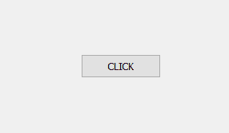
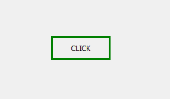
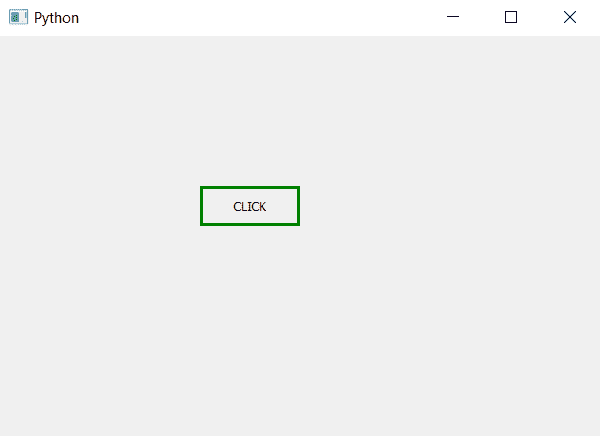

# PyQt5–设置按钮的边框

> 原文:[https://www . geesforgeks . org/pyqt 5-设置边框到按钮/](https://www.geeksforgeeks.org/pyqt5-set-border-to-the-push-button/)

在本文中，我们将看到如何为按钮添加边框。虽然按钮已经有边框，但边框是默认的。PyQt5 允许我们使用`setStyleSheet`方法改变按钮的边框。

下面是带有默认边框和自定义边框的按钮示例。
 

> **语法:**button .set 样式表(“边框:3px 纯绿色”)
> 
> **自变量:**以字符串为自变量
> 
> **执行的动作:**改变按钮的边框

**代码:**

```py
# importing libraries
from PyQt5.QtWidgets import * 
from PyQt5.QtGui import * 
from PyQt5.QtCore import * 
import sys

class Window(QMainWindow):
    def __init__(self):
        super().__init__()

        # setting title
        self.setWindowTitle("Python ")

        # setting geometry
        self.setGeometry(100, 100, 600, 400)

        # calling method
        self.UiComponents()

        # showing all the widgets
        self.show()

    # method for widgets
    def UiComponents(self):

        # creating a push button
        button = QPushButton("CLICK", self)

        # setting geometry of button
        button.setGeometry(200, 150, 100, 40)

        # adding border to button
        button.setStyleSheet("border :3px solid green")

        # adding action to a button
        button.clicked.connect(self.clickme)

    # action method
    def clickme(self):

        # printing pressed
        print("pressed")

# create pyqt5 app
App = QApplication(sys.argv)

# create the instance of our Window
window = Window()

# start the app
sys.exit(App.exec())
```

**输出:**
