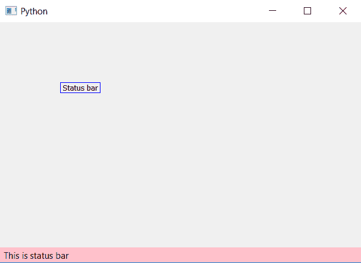

# PyQt5–将颜色设置到状态栏

> 原文:[https://www . geesforgeks . org/pyqt 5-将颜色设置为状态栏/](https://www.geeksforgeeks.org/pyqt5-set-color-to-a-status-bar/)

在本文中，我们将看到如何为状态栏设置颜色。默认情况下，状态栏没有颜色，但是 PyQt5 为我们提供了编辑状态栏颜色的功能。我们可以通过`setStyleSheet()`方法来做到这一点。

> **self.statusBar()。设置样式表(“背景色:黄色”)**
> 
> ****自变量:**它以字符串为自变量。**
> 
>  ****执行的动作:**设置状态栏颜色。**

****代码:****

```
from PyQt5.QtCore import * 
from PyQt5.QtGui import * 
from PyQt5.QtWidgets import * 
import sys

class Window(QMainWindow):
    def __init__(self):
        super().__init__()

        # set the title
        self.setWindowTitle("Python")

        # setting  the geometry of window
        self.setGeometry(60, 60, 600, 400)

        # setting status bar message
        self.statusBar().showMessage("This is status bar")

        # setting color to status bar
        self.statusBar().setStyleSheet("background-color : pink")

        # creating a label widget
        self.label_1 = QLabel("Status bar", self)

        # moving position
        self.label_1.move(100, 100)

        # setting up the border
        self.label_1.setStyleSheet("border :1px solid blue;")

        # resizing label
        self.label_1.adjustSize()

        # show all the widgets
        self.show()

# create pyqt5 app
App = QApplication(sys.argv)

# create the instance of our Window
window = Window()

# start the app
sys.exit(App.exec())
```

****输出:**
**