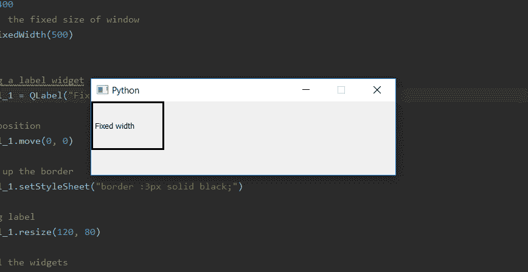
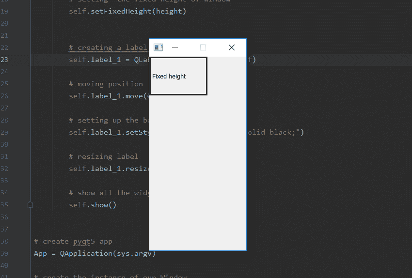

# pyqt 5–设置高度或宽度的固定窗口尺寸

> 原文:[https://www . geesforgeks . org/pyqt 5-set-fix-window-size-for-height-or-width/](https://www.geeksforgeeks.org/pyqt5-set-fix-window-size-for-height-or-width/)

当我们创建一个窗口时，默认情况下窗口大小是可调整的，虽然我们可以使用`setFixedSize()`方法来设置窗口的固定大小，但是如果我们只想设置固定长度的高度或宽度，我们就不能使用这个方法。我们想设置一个长度固定，另一个长度可变，因此我们必须使用`setFixedWidth()`方法设置宽度的固定长度和`setFizedHeight()`方法设置高度的固定长度。

> **语法:**
> 
> ```py
> self.setFixedWidth(width)
> self.setFixedHeight(height)
> 
> ```
> 
> **自变量:**两者均以整数为自变量。
> 
> **执行的动作:**
> `setFixedWidth()`设置恒定宽度。
> `setFixedWidth()`设置恒定高度。

**固定宽度代码–**

```py
# importing the required libraries

from PyQt5.QtCore import * 
from PyQt5.QtGui import * 
from PyQt5.QtWidgets import * 
import sys

class Window(QMainWindow):
    def __init__(self):
        super().__init__()

        # set the title
        self.setWindowTitle("Python")

        width = 500

        # setting  the fixed width of window
        self.setFixedWidth(width)

        # creating a label widget
        self.label_1 = QLabel("Fixed width", self)

        # moving position
        self.label_1.move(0, 0)

        # setting up the border
        self.label_1.setStyleSheet("border :3px solid black;")

        # resizing label
        self.label_1.resize(120, 80)

        # show all the widgets
        self.show()

# create pyqt5 app
App = QApplication(sys.argv)

# create the instance of our Window
window = Window()

# start the app
sys.exit(App.exec())
```

**输出:**


**固定高度的代码–**

```py
# importing the required libraries

from PyQt5.QtCore import * 
from PyQt5.QtGui import * 
from PyQt5.QtWidgets import * 
import sys

class Window(QMainWindow):
    def __init__(self):
        super().__init__()

        # set the title
        self.setWindowTitle("Python")

        height = 400
        # setting  the fixed height of window
        self.setFixedHeight(height)

        # creating a label widget
        self.label_1 = QLabel("Fixed height", self)

        # moving position
        self.label_1.move(0, 0)

        # setting up the border
        self.label_1.setStyleSheet("border :3px solid black;")

        # resizing label
        self.label_1.resize(120, 80)

        # show all the widgets
        self.show()

# create pyqt5 app
App = QApplication(sys.argv)

# create the instance of our Window
window = Window()

# start the app
sys.exit(App.exec())
```

**输出:**
