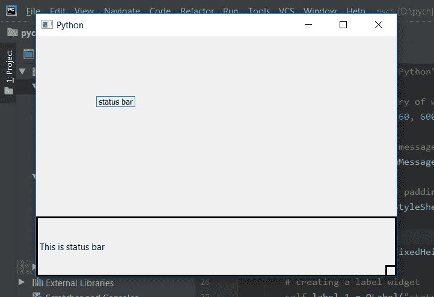

# pyqt 5–为状态栏

的宽度/高度设置固定长度

> 原文:[https://www . geeksforgeeks . org/pyqt 5-设置-固定长度-宽度-高度-状态栏/](https://www.geeksforgeeks.org/pyqt5-set-fixed-length-for-width-height-of-status-bar/)

当窗口被调整大小时，状态栏也会被调整大小，虽然我们可以使用`setFixedSize`方法对状态栏对象设置一个固定大小的状态栏。在这篇文章中，我们将看到我们如何只能固定宽度或高度的长度，即另一边是可变的。

为了固定宽度的长度，我们对状态栏对象使用`setFixedWidth`，为了固定高度的长度，我们对状态栏对象使用`setFixedHeight`。

> **语法:**
> 
> ```py
> self.statusBar().setFixedHeight(height)
> self.statusBar().setFixedWidth(width)
> 
> ```
> 
> **自变量:**两种方法都以整数为自变量。
> 
> **执行动作:**
> `setFixedHeight`固定状态栏高度。
> `setFixedWidth`固定状态栏宽度。

**代码:**

```py
from PyQt5.QtCore import * 
from PyQt5.QtGui import * 
from PyQt5.QtWidgets import * 
import sys

class Window(QMainWindow):
    def __init__(self):
        super().__init__()

        # set the title
        self.setWindowTitle("Python")

        # setting  the geometry of window
        self.setGeometry(60, 60, 600, 400)

        # setting status bar message
        self.statusBar().showMessage("This is status bar")

        # setting  border and padding with different sizes
        self.statusBar().setStyleSheet("border :3px solid black;")

        # setting fixed width
        self.statusBar().setFixedHeight(100)

        # creating a label widget
        self.label_1 = QLabel("status bar", self)

        # moving position
        self.label_1.move(100, 100)

        # setting up the border
        self.label_1.setStyleSheet("border :1px solid blue;")

        # resizing label
        self.label_1.adjustSize()

        # show all the widgets
        self.show()

# create pyqt5 app
App = QApplication(sys.argv)

# create the instance of our Window
window = Window()

# start the app
sys.exit(App.exec())
```

**输出:**
