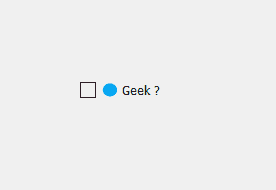
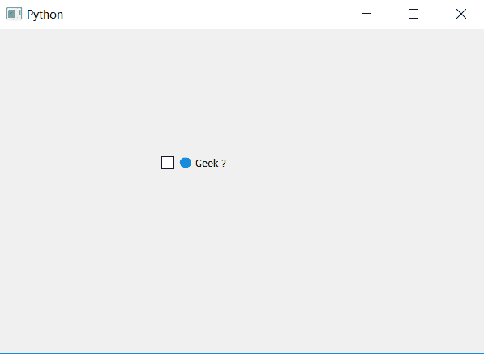

# PyQt5–设置复选框图标

> 原文:[https://www.geeksforgeeks.org/pyqt5-set-icon-for-check-box/](https://www.geeksforgeeks.org/pyqt5-set-icon-for-check-box/)

在本文中，我们将了解如何将图标设置为复选框。将图标设置到复选框类似于将图标设置到主窗口，复选框的图标出现在指示器和复选框之间。下面是带有图标的复选框和普通复选框的区别。

 

为了做到这一点，我们将使用`setIcon`方法。

> **语法:**checkbox . seticon(QIcon(' icon . png ')
> 
> **参数:**它以文件名或路径作为参数。
> 
> **执行的操作:**将图标设置为复选框

下面是实现。

```
# importing libraries
from PyQt5.QtWidgets import * 
from PyQt5 import QtCore, QtGui
from PyQt5.QtGui import * 
from PyQt5.QtCore import * 
import sys

class Window(QMainWindow):

    def __init__(self):
        super().__init__()

        # setting title
        self.setWindowTitle("Python ")

        # setting geometry
        self.setGeometry(100, 100, 600, 400)

        # calling method
        self.UiComponents()

        # showing all the widgets
        self.show()

    # method for widgets
    def UiComponents(self):

        # creating the check-box
        checkbox = QCheckBox('Geek ?', self)

        # setting geometry of check box
        checkbox.setGeometry(200, 150, 100, 30)

        # setting icon to check box
        checkbox.setIcon(QIcon('logo.png'))

# create pyqt5 app
App = QApplication(sys.argv)

# create the instance of our Window
window = Window()

# start the app
sys.exit(App.exec())
```

**输出:**
