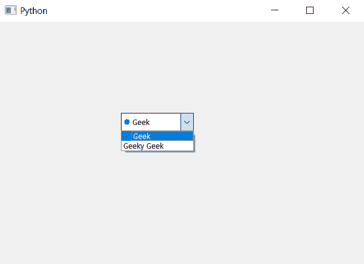

# PyQt5–在组合框

中设置项目图标的图标大小

> 原文:[https://www . geesforgeks . org/pyqt5-set-icon-item-size-icon-in-combobox/](https://www.geeksforgeeks.org/pyqt5-set-icon-size-of-item-icon-in-combobox/)

在本文中，我们将看到如何设置组合框项目的图标大小。默认情况下，组合框中的图标没有设置图标，虽然我们可以借助`setItemIcon`方法为每个项目设置图标，但有时需要调整图标大小。

为了改变项目图标的图标大小，我们将使用`setIconSize`方法。

> **语法:** combobox.setIconSize(大小)
> 
> **自变量:**它以 QSize 对象为自变量
> 
> **动作**将设置项目的图标大小

以下是实施–

```py
# importing libraries
from PyQt5.QtWidgets import * 
from PyQt5 import QtCore, QtGui
from PyQt5.QtGui import * 
from PyQt5.QtCore import * 
import sys

class Window(QMainWindow):

    def __init__(self):
        super().__init__()

        # setting title
        self.setWindowTitle("Python ")

        # setting geometry
        self.setGeometry(100, 100, 600, 400)

        # calling method
        self.UiComponents()

        # showing all the widgets
        self.show()

    # method for widgets
    def UiComponents(self):

        # creating a combo box widget
        self.combo_box = QComboBox(self)

        # setting geometry of combo box
        self.combo_box.setGeometry(200, 150, 120, 30)

        # geek list
        geek_list = ["Geek", "Geeky Geek"]

        # adding list of items to combo box
        self.combo_box.addItems(geek_list)

        # creating editable combo box
        self.combo_box.setEditable(True)

        # index
        index = 0

        # icon
        icon = QIcon('logo.png')

        # adding icon to the given index
        self.combo_box.setItemIcon(index, icon)

        # size
        size = QSize(10, 10)

        # setting icon size
        self.combo_box.setIconSize(size)

# create pyqt5 app
App = QApplication(sys.argv)

# create the instance of our Window
window = Window()

# start the app
sys.exit(App.exec())
```

**输出:**
