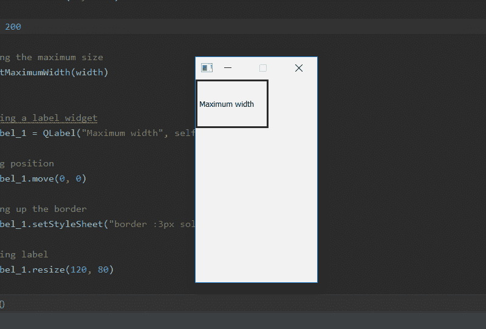
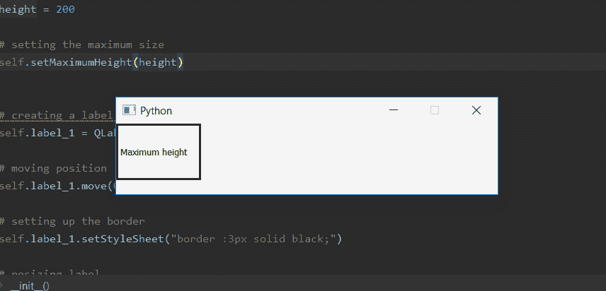

# PyQt5–设置窗户的最大宽度或高度

> 原文:[https://www . geeksforgeeks . org/pyqt 5-set-窗户宽度或高度的最大尺寸/](https://www.geeksforgeeks.org/pyqt5-set-maximum-size-for-width-or-height-of-window/)

当我们创建窗口时，默认情况下窗口大小是可调整的，尽管我们可以使用`setMaximumSize()`方法来设置窗口的最大大小。但是如果我们只想为宽度或高度设置最大长度呢？为此，我们使用`setMaximumWidth()`和`setMaximumHeight()`方法设置最大宽度/高度。当我们使用这些方法时，其他长度将是可变的，即没有最大长度，它可以拉伸到屏幕的大小。

> **语法:**
> 
> ```py
> self.setMaximumWidth(width)
> self.setMaximumHeight(height)
> 
> ```
> 
> **自变量:**两者均以整数为自变量。
> 
> **执行的动作:**
> `setMaximumWidth()`设置最大宽度。
> `setMaximumHeight()`设置最大高度。

**最大宽度代码–**

```py
# importing the required libraries

from PyQt5.QtCore import * 
from PyQt5.QtGui import * 
from PyQt5.QtWidgets import * 
import sys

class Window(QMainWindow):
    def __init__(self):
        super().__init__()

        # set the title
        self.setWindowTitle("Python")

        width = 200

        # setting the maximum width
        self.setMaximumWidth(width)

        # creating a label widget
        self.label_1 = QLabel("Maximum width", self)

        # moving position
        self.label_1.move(0, 0)

        # setting up the border
        self.label_1.setStyleSheet("border :3px solid black;")

        # resizing label
        self.label_1.resize(120, 80)

        # show all the widgets
        self.show()

# create pyqt5 app
App = QApplication(sys.argv)

# create the instance of our Window
window = Window()

# start the app
sys.exit(App.exec())
```

**输出:**


**最大高度代码–**

```py
# importing the required libraries

from PyQt5.QtCore import * 
from PyQt5.QtGui import * 
from PyQt5.QtWidgets import * 
import sys

class Window(QMainWindow):
    def __init__(self):
        super().__init__()

        # set the title
        self.setWindowTitle("Python")

        height = 200

        # setting the maximum height
        self.setMaximumHeight(height)

        # creating a label widget
        self.label_1 = QLabel("Maximum height", self)

        # moving position
        self.label_1.move(0, 0)

        # setting up the border
        self.label_1.setStyleSheet("border :3px solid black;")

        # resizing label
        self.label_1.resize(120, 80)

        # show all the widgets
        self.show()

# create pyqt5 app
App = QApplication(sys.argv)

# create the instance of our Window
window = Window()

# start the app
sys.exit(App.exec())
```

**输出:**
