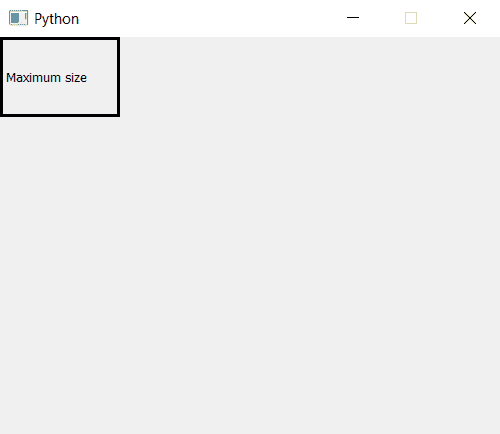

# PyQt5–设置最大窗口尺寸

> 原文:[https://www . geeksforgeeks . org/pyqt 5-set-最大窗口大小/](https://www.geeksforgeeks.org/pyqt5-set-maximum-window-size/)

当我们创建一个窗口时，默认情况下，它是可调整大小的，但是借助`setFixedSize()`方法，我们可以固定窗口的大小。但是如果我们想向上调整窗口的大小——在某种程度上；为了做到这一点，我们必须设置窗口的最大大小。我们将使用`setMaximumSize()`方法。

> **语法:** self.setMaximumSize(宽度、高度)
> 
> **参数:**它需要两个整数参数，即宽度和高度。
> 
> **执行的动作:**设置窗口的最大尺寸。

**代码:**

```
# importing the required libraries

from PyQt5.QtCore import * 
from PyQt5.QtGui import * 
from PyQt5.QtWidgets import * 
import sys

class Window(QMainWindow):
    def __init__(self):
        super().__init__()

        # set the title
        self.setWindowTitle("Python")

        width = 500
        height = 400
        # setting the maximum size
        self.setMaximumSize(width, height)

        # creating a label widget
        self.label_1 = QLabel("Maximum size", self)

        # moving position
        self.label_1.move(0, 0)

        # setting up the border
        self.label_1.setStyleSheet("border :3px solid black;")

        # resizing label
        self.label_1.resize(120, 80)

        # show all the widgets
        self.show()

# create pyqt5 app
App = QApplication(sys.argv)

# create the instance of our Window
window = Window()

# start the app
sys.exit(App.exec())
```

**输出:**
