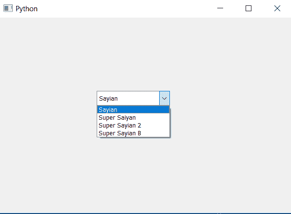

# pyqt 5–将最小内容长度设置为组合框项目

> 原文:[https://www . geesforgeks . org/pyqt 5-set-最小内容长度到组合框-item/](https://www.geeksforgeeks.org/pyqt5-set-minimum-content-length-to-combobox-item/)

在本文中，我们将看到如何设置组合框项目的最小长度，也就是说，这个属性保存了组合框应该容纳的最小字符数。为此我们将使用`setMinimumContentsLength`方法，默认情况下组合框的最小长度为 0。

> **语法:**组合框
> 
> **自变量:**以整数为自变量
> 
> **返回:**无效

以下是实施–

```
# importing libraries
from PyQt5.QtWidgets import *
from PyQt5 import QtCore, QtGui
from PyQt5.QtGui import *
from PyQt5.QtCore import *

import sys

class Window(QMainWindow):

    def __init__(self):
        super().__init__()

        # setting title
        self.setWindowTitle("Python ")

        # setting geometry
        self.setGeometry(100, 100, 600, 400)

        # calling method
        self.UiComponents()

        # showing all the widgets
        self.show()

    # method for widgets
    def UiComponents(self):

        # creating a combo box widget
        self.combo_box = QComboBox(self)

        # setting geometry of combo box
        self.combo_box.setGeometry(200, 150, 150, 30)

        # geek list
        geek_list = ["Sayian", "Super Saiyan", "Super Sayian 2", "Super Sayian B"]

        # making it editable
        self.combo_box.setEditable(True)

        # adding list of items to combo box
        self.combo_box.addItems(geek_list)

        # setting minimum content length
        self.combo_box.setMinimumContentsLength(3)

# create pyqt5 app
App = QApplication(sys.argv)

# create the instance of our Window
window = Window()

# start the app
sys.exit(App.exec())
```

**输出:**
